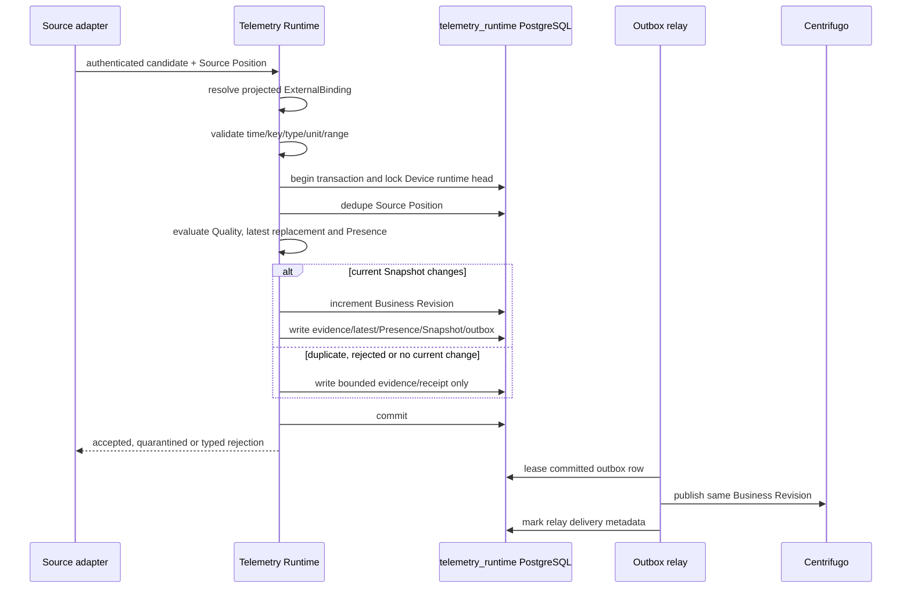
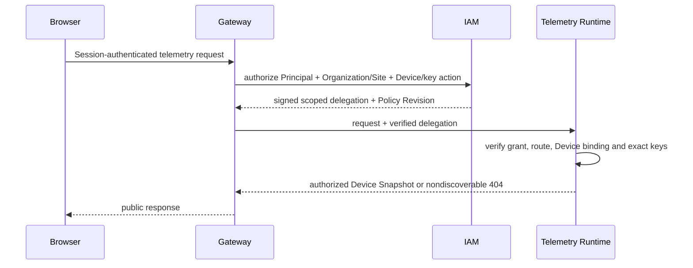

# ADR 0003 — S2 telemetry runtime ownership and service boundary

Status: accepted

Date: 2026-07-23

Issue: #50

## Context

S2 needs one authoritative platform boundary for Device Presence, latest accepted telemetry, Device Snapshot, business Revision, subscription authorization and live publication. The Legacy implementation cannot provide that boundary because the same Redis key is written by a public ThingsBoard webhook, a demand-driven ThingsBoard WebSocket path and REST read-through backfill, with no shared monotonic rule or authorization model.

The prior decisions establish two constraints:

- ADR 0002 defines Presence, Freshness, Quality and Evaluation Availability as platform-owned semantics and requires a single owner for accepted observations, policy revision and monotonic Revision.
- The Centrifugo experiment adopts Centrifugo only for connection transport, fan-out, bounded epoch/offset recovery and queue enforcement. Snapshot, business Revision, authorization, revocation and fallback remain platform responsibilities.

S2 must therefore decide which existing or new service owns runtime truth, how Registry and ThingsBoard identities are mapped, what is durable, what may be cached, and which data flows are prohibited.

## Decision

### 1. Create a dedicated Telemetry Runtime bounded context

A new `telemetry-runtime-service` is the unique owner of the Telemetry Runtime bounded context.

It owns:

- source authentication and observation acceptance;
- the local runtime projection of Core-owned Device and ExternalBinding facts;
- Presence and Freshness policy definitions and assignments;
- accepted Presence Signals;
- latest accepted Telemetry Observations;
- Device Presence evaluation;
- coherent Device Observation Snapshots;
- monotonic per-Device Business Revision;
- ingest deduplication and quarantine;
- subscription authorization at the Device/key seam after IAM delegation;
- the publication outbox;
- the decision to accept transport recovery or require a new Snapshot.

The service is not a pass-through ThingsBoard facade. It contains the state transition rules that turn source candidates into platform runtime truth.

### 2. Do not place runtime ownership in existing services

The following alternatives are rejected.

| Candidate | Rejection reason |
|---|---|
| `legacy-hvac-backend` | It already has multiple latest writers, Legacy identifiers, direct ThingsBoard reads and process-local subscription state. Making it the S2 owner would preserve the ambiguity S2 exists to remove. |
| `platform-core-service` | Core owns low-frequency Registry identity and binding lifecycle. High-frequency ingest, Presence evaluation, publication and runtime outage handling are a separate failure and scaling domain. Combining them would couple Device inventory availability to telemetry volume and source instability. |
| `platform-gateway` | Gateway is the public Session and routing seam. Storing or merging telemetry there would make the edge tier a business database and publication owner. |
| `iam-service` | IAM owns authorization facts, not telemetry state or Device evaluation. |
| ThingsBoard | ThingsBoard is an upstream integration and historical store. Its Device IDs, activity attributes and telemetry history are not platform identity or S2 semantics. |
| Redis or Centrifugo | They are storage/transport implementations, not business owners. Redis state and Centrifugo epoch/offset cannot define Snapshot or Business Revision. |

A dedicated owner creates one deep module: callers learn one Snapshot/ingest/subscription interface while source mapping, ordering, quality, Presence, persistence and publication complexity remain local.

### 3. Authoritative persistence is PostgreSQL Schema `telemetry_runtime`

The authoritative business store is PostgreSQL Schema `telemetry_runtime`.

Ownership identities are:

```text
migration role: s2_telemetry_migrator
runtime role:   s2_telemetry_runtime
owner service:  telemetry-runtime-service
```

Runtime roles are `NOLOGIN`, `NOBYPASSRLS` group identities and do not own tables or RLS policies. Organization- and Site-leading predicates are mandatory in application queries and PostgreSQL RLS.

The initial logical tables are:

| Logical table | Purpose |
|---|---|
| `device_runtime_bindings` | Read-only projection of Core-owned Device, Organization, Site, integration instance and active ExternalBinding facts, including the Core revision used. |
| `presence_policies` | Versioned Presence Policy definitions. |
| `freshness_policies` | Versioned key Freshness and Quality Policy definitions. |
| `device_policy_assignments` | Device or Device-class policy assignment with effective revision. |
| `device_runtime_heads` | Per-Device Business Revision, current Evaluation Availability and Snapshot metadata. |
| `latest_observations` | Latest accepted observation per Device/key with value, type, unit, Quality, reason codes, `sampledAt`, `receivedAt` and source identity. |
| `device_presence` | Current Presence conclusion, Last Seen, policy revision, evidence basis and evaluation time. |
| `observation_evidence` | Bounded accepted/rejected candidate evidence used for audit, ordering diagnosis and reconciliation; not a public long-term timeseries store. |
| `ingest_receipts` | Source Position deduplication and replay evidence. |
| `ingest_quarantine` | Candidates whose source, mapping or validation prevents them from becoming current state. |
| `telemetry_publication_outbox` | Transactional publication intent for committed Device Snapshot changes. |

Exact DDL and retention are implementation-ticket decisions, but the ownership and transaction grouping are fixed by this ADR.

### 4. One business writer, one restricted relay

`telemetry-runtime-service` is the only business writer to Schema `telemetry_runtime`.

`outbox-relay` may have restricted relay access only to `telemetry_publication_outbox`. It may lease rows, record attempts and mark delivery metadata. It cannot mutate latest values, Presence, policy, mapping, Snapshot or Business Revision.

A source adapter, Gateway, Core, IAM, Legacy backend, ThingsBoard, Redis and Centrifugo have no direct write access to the Schema.

### 5. Three position concepts remain distinct

S2 preserves three non-interchangeable position concepts.

#### Business Revision

A monotonic integer owned by `telemetry-runtime-service`, scoped to one Device Observation Snapshot.

It advances exactly once when a committed current Snapshot changes, including a change to:

- latest accepted values or Quality;
- Device Presence or Last Seen;
- Evaluation Availability;
- the effective policy revision represented by the Snapshot;
- mapping applicability that changes current runtime interpretation.

It does not advance for:

- duplicate delivery;
- rejected or out-of-order candidates that do not alter current state;
- outbox retry or duplicate publication;
- cache refresh;
- Centrifugo reconnect;
- a historical read.

#### Source Position

An upstream event identity or offset owned by the source adapter contract, for example an integration-instance/event ID or partition/offset pair. It supports deduplication, replay evidence and reconciliation.

A Source Position is never exposed as a public Cursor and never determines client application order by itself.

#### Transport Position

Centrifugo stream `epoch` and `offset`, used only for bounded reconnect recovery. It does not replace Business Revision and does not prove that a recovered suffix is a coherent current Snapshot.

#### Recovery Cursor

An opaque platform contract owned by `telemetry-runtime-service` that binds the recovery request to contract version, route/scope, the client's last applied Business Revision and the underlying Transport Position.

A Recovery Cursor has no business authority. Reuse requires current authorization and an exact route, Organization, Site, Device and key-scope match. Invalid, expired, mismatched or unsuccessful recovery always falls back to an authoritative Device Observation Snapshot. Issue #51 defines whether the wire form is an explicit token, SDK-managed state or a subscription descriptor, but it cannot transfer ownership to Gateway or Centrifugo.

### 6. Registry identity and ThingsBoard mapping

`platform-core-service` remains the unique owner of:

- immutable Registry Device UUIDv7 identity;
- Registry Lifecycle;
- ExternalBinding identity and active uniqueness;
- binding migration, quarantine and retirement.

Telemetry Runtime consumes Core-owned binding changes through event family `hvac.registry.external-binding.v1` and maintains a local projection. It also has a reconciliation interface to Core so missed events cannot permanently corrupt the projection.

A source candidate resolves by:

```text
integrationInstanceId
+ externalEntityType
+ externalId
→ exactly one active ExternalBinding
→ Registry Device UUIDv7 + Organization + Site
```

Rules:

1. Zero active bindings produces ingest quarantine reason `MAPPING_NOT_FOUND`.
2. More than one active binding produces `MAPPING_CONFLICT` and an alert. Core uniqueness should make this impossible, but the ingest boundary still fails closed.
3. A retired or quarantined mapping produces quarantine and no current-state mutation.
4. An observation never creates a Device, ExternalBinding or Site assignment.
5. A mapping failure does not reveal whether a matching Device exists in another Organization or Site.
6. Public snapshots and publications contain only platform IDs. ThingsBoard IDs remain internal evidence.

Core and Telemetry Runtime never write each other's Schema. Binding propagation is event plus reconciliation, not cross-schema mutation or reverse synchronization.

### 7. Ingest transaction and publication sequence

Every source path, including live push, webhook, replay and ThingsBoard reconciliation readback, enters the same acceptance module.



Atomicity rules:

- No publication occurs before the authoritative transaction commits.
- A failed transaction produces no new Business Revision and no publication.
- Publication is at-least-once. Retries use the same event ID and Business Revision.
- A duplicate publication is harmless because clients apply Business Revision rules.
- An adapter may retry or buffer transport delivery, but it cannot acknowledge a candidate as current platform truth before the owner commits it.

### 8. Source readback is reconciliation, not read-through

ThingsBoard readback is permitted only as an internal reconciliation source.

The reconciler:

1. authenticates as a workload;
2. resolves the same Core-owned mapping projection;
3. records a Source Position or deterministic reconciliation identity;
4. submits candidates through the same acceptance module;
5. preserves actual source timestamps;
6. receives the same duplicate, ordering, Quality and quarantine treatment as every other source.

Public Snapshot/latest reads never call ThingsBoard to fill a miss, repair Redis or overwrite latest state. A read cannot cause a hidden business write.

### 9. Snapshot read order and partial-result rules

The authority order is:

```text
PostgreSQL telemetry_runtime
> optional owner-written revisioned cache replica
> ThingsBoard as reconciliation input only
```

The optional cache is not required for the first implementation. When introduced, it must contain the complete Device Snapshot payload, Business Revision and original evaluation/sample/receipt timestamps.

Read rules:

1. Every request is authorized against current IAM facts before state is returned.
2. Authorization failure or IAM unavailability fails closed; cached telemetry cannot authorize itself.
3. A normal current Snapshot comes from the authoritative owner state.
4. If PostgreSQL is unavailable, a cache may provide Last Known context only when the response explicitly reports Evaluation Availability `UNAVAILABLE`, preserves its old timestamps and marks the value non-current.
5. No cache value may be stamped with the current request time to simulate freshness.
6. ThingsBoard is never queried on the public read path.
7. One Device Snapshot is coherent at one Business Revision.
8. A multi-Device batch is a collection of per-Device results, not one global transaction. Missing, unauthorized or unavailable items must be typed explicitly; they cannot become silent empty objects or cause unrelated items to be relabelled successful.
9. Per-key `MISSING`, `STALE` and `SUSPECT` states are valid explicit Snapshot content. Silent omission is not a partial-result contract.

The exact wire representation is deferred to Issue #51, but the ownership and truth semantics are fixed here.

### 10. Public request and subscription authorization

`platform-gateway` remains the public Session boundary. `iam-service` remains the owner of authorization facts, explicit denies and IAM Policy Revision.

For a Snapshot request:



The Gateway does not construct business telemetry, cache Snapshot state or trust browser-supplied identity headers.

For live subscription:

1. Gateway authenticates the Session and issues a short-lived transport bootstrap derived from current platform identity.
2. The browser requests an internal Device/key channel.
3. Centrifugo calls the Telemetry Runtime subscribe proxy.
4. Telemetry Runtime verifies current scoped authorization, current mapping and requested keys.
5. Denial is nondiscoverable and fails closed.
6. IAM revocation event family `hvac.iam.authorization-revoked.v1` is consumed by Telemetry Runtime.
7. Telemetry Runtime records the revocation watermark and invokes Centrifugo server unsubscribe for affected live subscriptions.
8. Resubscribe is re-evaluated and denied.

Centrifugo performs unsubscribe delivery but does not own the revocation fact or audit record.

### 11. Transport persistence uses dedicated Redis

The production Centrifugo candidate uses a dedicated Redis deployment/namespace for transport broker and short-window history.

It is not shared with Legacy Redis and contains no authoritative latest-value keys.

Its responsibility is limited to:

- node-to-node publication fan-out;
- epoch/offset stream position;
- bounded recovery history;
- connection and queue coordination required by the selected Centrifugo engine.

Loss or expiry of Redis history causes Snapshot fallback. It does not cause data reconstruction from ThingsBoard on the public path.

The Redis topology, retention duration and capacity values remain rollout-gate decisions, but the separation from Legacy Redis and PostgreSQL business authority is fixed.

### 12. Historical timeseries remains outside S2

Long-range historical timeseries is not owned by Telemetry Runtime in this slice.

During compatibility:

- `legacy-hvac-backend` owns the historical public route;
- ThingsBoard remains its source;
- Gateway and IAM still enforce current Organization/Site/Device authorization;
- the route is separately registered and observable;
- its response cannot update Telemetry Runtime latest state;
- S2 Snapshot/latest routes never fall back to it;
- no reverse write from S2 to ThingsBoard is introduced.

A future historical-data owner requires a separate ADR and migration plan.

### 13. Failure behavior

| Failure | Required behavior |
|---|---|
| Source authentication fails | Reject before mapping lookup; record bounded security evidence. |
| Mapping missing/conflicting/quarantined | Put candidate in Ingest Quarantine; do not create a Device or current state. |
| PostgreSQL owner unavailable | Do not acknowledge a current-state commit or publish a new Revision. Public reads return typed unavailability; Last Known cache context is non-current only. |
| Optional cache unavailable | Read PostgreSQL directly; no business degradation when authority is healthy. |
| IAM unavailable | Fail closed for new reads and subscriptions. Existing subscriptions are bounded by short lifetime and explicit revocation state; no cache bypass. |
| Core binding event delayed | Continue using the last reconciled projection with its Core revision; quarantine candidates that cannot be resolved; alert projection lag. |
| Outbox relay unavailable | Authoritative state commits remain durable; publication lags and is retried with the same Revision. Snapshot reads still return current committed state. |
| Centrifugo unavailable | Snapshot remains available; realtime delivery is explicitly unavailable. |
| Redis transport history lost | Recovery fails and the client loads a new authoritative Snapshot. |
| ThingsBoard unavailable | New source observations may stop; Evaluation Availability follows ADR 0002 coverage rules. No public read-through fallback. |
| Legacy backend unavailable | S2 current Snapshot and Presence are unaffected; only historical compatibility may fail. |
| Duplicate or delayed source event | Record/deduplicate; do not replace newer current state or advance Revision. |
| Revocation stream unhealthy | New subscriptions fail closed; operators are alerted; no authorization bypass. |

### 14. Forbidden data flows

The following paths are prohibited:

```text
browser -> ThingsBoard
public latest read -> ThingsBoard read-through -> latest write
ThingsBoard -> latest projection direct write
Legacy backend -> telemetry_runtime business write
Legacy Redis -> S2 current state
cache -> subscription authorization
Centrifugo history -> Snapshot authority
S2 latest -> ThingsBoard reverse sync
Core <-> Telemetry Runtime cross-schema business writes
shadow/fallback comparison -> side effects
```

Migration comparisons are read-only. A shadow path may compare Legacy and S2 results and record bounded evidence, but cannot publish, repair either side or change authorization.

### 15. Ownership table

| Resource or decision | Unique owner | Permitted consumers/adapters | Explicitly not owner |
|---|---|---|---|
| Registry Device and Lifecycle | `platform-core-service` | Gateway, IAM, Telemetry Runtime projection | ThingsBoard, Legacy Redis, Centrifugo |
| ExternalBinding and mapping quarantine | `platform-core-service` | Telemetry Runtime projection/reconciler | source observation, Telemetry Runtime ingest |
| IAM authorization and Policy Revision | `iam-service` | Gateway and Telemetry Runtime through signed delegation/events | Gateway cache, Centrifugo channel name |
| Presence/Freshness policy | `telemetry-runtime-service` | Snapshot evaluation, UI/FDD consumers through contract | Core lifecycle, ThingsBoard attributes |
| Latest accepted telemetry | `telemetry-runtime-service` | Snapshot, publication, bounded cache replica | ThingsBoard, Legacy Redis, REST read-through |
| Device Presence | `telemetry-runtime-service` | Snapshot and publication | Registry Lifecycle, Centrifugo presence |
| Device Observation Snapshot | `telemetry-runtime-service` | Gateway, browser, FDD and future control contracts | cache, ThingsBoard, Gateway |
| Business Revision | `telemetry-runtime-service` | client reconciliation, outbox publication | Source Position, Centrifugo offset |
| Source Position | source adapter contract; persisted by Telemetry Runtime | ingest dedupe and reconciliation | browser recovery |
| Transport Position | Centrifugo | client SDK reconnect logic | business ordering and Snapshot authority |
| Recovery Cursor | `telemetry-runtime-service` | Gateway/Centrifugo adapters and authorized clients | Gateway, Centrifugo history, cache |
| Publication intent | `telemetry-runtime-service` | restricted `outbox-relay` | direct source publisher |
| Realtime transport | Centrifugo | browser transport adapter | business state owner |
| Transport history | dedicated Redis through Centrifugo | bounded recovery only | latest/Persistence authority |
| Historical timeseries compatibility | `legacy-hvac-backend` | authorized compatibility callers | S2 latest and Presence |

## Consequences

### Positive

- S2 has one business writer and one monotonic Revision rule.
- Registry identity, authorization, runtime state and transport each have separate owners.
- Public reads cannot mutate state or hide upstream failure through read-through.
- Multi-replica publication uses a durable outbox instead of process-local subscription authority.
- Centrifugo remains replaceable because no authoritative contract uses its epoch/offset as business state.
- Historical timeseries can remain available without contaminating the S2 current-state model.

### Costs

- A new service, PostgreSQL Schema, runtime identity, migrations, event consumers and operational SLO are required.
- Core binding and IAM revocation propagation need event plus reconciliation mechanisms.
- The platform must operate dedicated Redis for production Centrifugo transport.
- Legacy and S2 comparison requires explicit migration evidence rather than hidden fallback.

### Deferred to later tickets

`contracts/ownership/s2-telemetry-ownership.v1.json` is a planned ownership lock, not activation of an unimplemented production service. The implementation tickets must add the service, Schema and identities to the active Data Ownership Registry only when their migrations and enforcement exist.

Issue #51 defines the public Snapshot, batch, subscription, publication and recovery wire contracts.

Issue #52 defines metrics, capacity targets, Redis/Centrifugo retention, publication lag SLO, projection-lag SLO, canary and rollback gates.

Issue #53 splits implementation into ordered tracer-bullet tickets.

## Architecture Decision Trace

| Issue #50 requirement | Decision location | Machine-readable asset |
|---|---|---|
| Unique Presence/latest/Revision/subscription owner | Sections 1–5 | `ownerService`, `ownedResources`, `positions` |
| Core, Gateway, IAM, Legacy, ThingsBoard and transport responsibility | Sections 2, 6, 10–15 | `serviceResponsibilities` |
| ThingsBoard ID to Device UUIDv7 mapping | Section 6 | `mappingRules` |
| Cache, persistence and readback authority | Sections 3, 8–9, 11 | `stores`, `snapshotReadOrder` |
| Schema, event family, projection and runtime identity | Sections 3–4, 6–7, 10 | `authoritativeStore`, `ownedResources`, `inputEvents`, `databaseAccess` |
| Single-writer transaction and publication | Sections 4 and 7 | `ingestTransaction` |
| Historical timeseries boundary | Section 12 | `historicalTimeseries` |
| Prohibited dual-write and reverse-sync paths | Section 14 | `forbiddenFlows` |

Changing the unique owner, authoritative store, Business Revision scope, mapping authority, Redis/TB authority order, historical compatibility ownership or any forbidden-flow rule requires a new ADR and a compatible ownership-contract revision.
