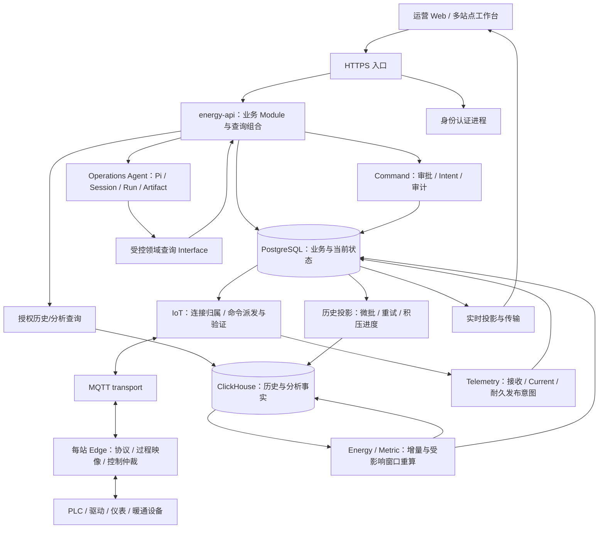

# 数十至数百站点智慧能源平台：架构审查与目标方案

日期：2026-09-07。状态：PROPOSED / 待按切片实施；不是上线认证，不替代现有 ADR 或 Phase 1 部署基线。

用户已确认：未来 1–2 年面向数十至数百站点集中管理。尚未确认：每站点位数、上报周期、变化上报比例、历史保留期、同时在线人数、团队规模和可用性要求。以下容量情景为规划假设，不能当作产品承诺。

本次只增加分析文档；未修改业务代码、运行配置、数据库、依赖和现有 ADR。分析包含未提交工作区，文件行号可能随并行开发变化。前一轮类型检查、构建和六个 Go 包测试通过，不构成本次架构方案或真实容量的验收。

## 1. 核心判断

推荐长期形态：**模块化业务核心 + 按负载隔离的数据处理进程 + 现场自治 Edge + 独立 AI 运行进程 + 明确的数据所有权**。

当前领域划分大体值得保留；主要问题是实现没有充分兑现边界：进程已经合并但仍有内部 HTTPS 链，历史批接口内部逐行写入，Energy 常态计算依赖逐条元数据查询和历史视图扫描，生产 Edge 装配仍归模拟器，Pi 新路径仍依赖旧 checkpoint 配置。重构应针对这些具体摩擦，而不是重命名目录或堆叠新基础设施。

现代化的验收标准是：容量可测、故障可控、领域可独立理解、部署可重复、数据可追踪、控制可验证。技术栈新旧和进程数量不直接证明这些性质。

## 2. 目标结构

图中方框是职责 Module，**不是一个方框一个部署进程**。History、Analytics 当前仍组合在 telemetry-worker；只有资源争用、积压恢复或故障域证据要求时，才把其中计算职责迁入已有计算 worker 或独立运行角色。不会为了图形对称新增进程。

### 运行角色的取舍

| 角色 | 目标职责 | 部署判断 |
| --- | --- | --- |
| energy-api | Registry、IAM 授权、Alarm、WorkOrder、Command 治理、Audit、BFF | 默认模块化合并；同进程使用领域 Interface，保留逻辑 Owner |
| identity-service | 用户认证、认证凭据、OIDC | 保持独立；本次未完成替换身份提供方的源码比较，不作更换决定 |
| iot-service | MQTT 接入、连接归属、云端执行与读回验证、Fleet 传输 | 按 Integration/连接分区扩展，不能随机增加相同 client ID 的副本 |
| telemetry-worker | 接收、Current、History publication、实时投影 | 优先修内部处理效率，再验证分区/副本；禁止 Redis 成为事实权威 |
| metric-worker | Metric 计算及其耐久 Job；后续按负载评估承载其他分析执行 | 计算资源与用户请求隔离；不因合并而合并领域数据写入权 |
| scheduler / maintenance | 调度协调 / 维护执行 | 暂保留现有职责；不把高权限维护移入在线 API；cron 解析单独做复用审查 |
| Forecast / Optimization / FDD | 各自输入、计算、结果与适用性 | 保留领域区分；是否合成一个分析运行进程属于待证实候选，不凭算法小就强行合并 |
| operations-agent | Pi 会话、受控查询、解释与人工交互 | 补齐唯一生产入口；模型耗时、凭据、预算与业务 API 隔离 |
| edge-runtime | 现场采集、过程映像、仲裁、联锁、断云运行和上传 | 从模拟器提取生产组合；Edge 不属于云端 API 副本 |

### 数据职责

- PostgreSQL：Tenant/Site/Registry、授权、Command/Alarm/WorkOrder/Audit、Current、Job/Outbox。保持领域角色与事务内作用域约束。物理共库不等于允许跨域任意写入。
- ClickHouse：正式发布后的遥测历史、能源及分析事实。Current 不从最终一致的分析表反推。历史修复需要版本、来源、影响区间和可验证重算。
- Redis：缓存、实时恢复及共享限流等可重建状态。失效处理按能力制定，不把数据不存在解释成设备离线。
- MQTT：设备与平台传输；传输 ACK、云端持久接收、设备执行和读回验证分别记录。
- 备份介质：必须存在异机保存与恢复证明。ClickHouse 可重建的前提是原始来源的保留范围确实覆盖目标窗口；不能仅因存在 Outbox/Edge 队列就承诺完整历史可恢复。

## 3. 容量模型与架构目标

设 S 为站点数、P 为每站上报点数、T 为秒级上报间隔，平均观测量 λ = S×P/T。消息数与观测行数不同，一条设备消息可以带多个 Point。

| 规划情景，非用户已确认配置 | 平均观测/s | 每日观测行 |
| --- | ---: | ---: |
| 30站 × 1,000点 / 60秒 | 500 | 43,200,000 |
| 100站 × 1,000点 / 60秒 | 1,667 | 144,000,000 |
| 300站 × 1,000点 / 60秒 | 5,000 | 432,000,000 |
| 300站 × 1,000点 / 10秒 | 30,000 | 2,592,000,000 |

现场采样频率、控制周期、云端上报频率、历史归档分辨率必须分别配置。并非所有点都需要按 Edge 控制周期全量上传；计量结算、故障分析所需原始信息也不能为了减量随意丢弃。

断网 D 秒形成 B=λD 的积压；希望 H 秒内追平且实时继续，消费能力须满足 μ≥λ+B/H。需再计入突发和实测余量。存储量用实测压缩 bytes/row、索引、WAL、备份和副本系数计算，不直接给无依据的硬件配置。

建议验收维度（具体数值在容量基线冻结时确定）：

1. 单站高负载、补传或坏绑定不能阻塞其他站的 Current/控制。
2. 记录 ingest p95/p99、每观测事务/WAL、Source partition 锁等待、连接池等待、Outbox 最老年龄、ClickHouse parts/merge backlog、查询扫描行数。
3. 在目标 λ 下混合运行实时、历史、重算、操作页面和必要控制；测试 μ 是否足以追平。
4. 分别测正常与故障恢复，不用平均吞吐掩盖尾延迟。
5. RPO/RTO、数据新鲜度和设备控制时限是不同合同，不能合成一个笼统“实时性”。

## 4. 优先改造候选：已确认源码事实

### A. 历史写入 Module：真实微批与明确重试语义（Strong，优先）

**证据：**`modules/telemetry/pkg/telemetry/history_clickhouse.go:129` 对每行发起工作，`:158-163` 每行 token、同步 INSERT 和 HTTP 请求。canonical `cmd/telemetry-worker/main.go:304,321,332` 默认256条、250ms tick、每tick一次 RelayOnce。不是只在旧独立 projector 里存在。

该默认单实例长期理想调度上界约 1,024行/s，未计真实 I/O；不是压测结果，也不代表所有部署都使用默认值。即使改变轮询参数，逐行 INSERT 造成的请求/part成本仍在。

Before：Claim多行 → N个单行请求 → 整批标记。After：Claim耐久工作 → 有界微批发布与恢复 → 可验证发布进度。

**关键约束：**现有 observations 是普通 MergeTree，去重窗口100000；重试整批、写成功未标记、超窗口重放都需要处理。新 lease 不是稳定 batch 身份。不能简单把每行 token 替换成随机批 token，也不能仅换 ReplacingMergeTree 后宣称物化聚合自动去重。

**建议：**保留 History Interface 与领域写入语义，收敛发布/重试实现；忙时在预算内连续消费，空闲才等待；批次同时受行数、字节数和时延约束。原始行与下游 count/avg/energy 在故障重试后均需一致。

**状态：**瓶颈形态已证实；微批方向明确。准确的批身份、跨窗口重放及物化视图修正机制尚未裁决。实施前必须补读当前 ClickHouse 26.3.12.3 对应固定源码/测试；本次只读取其官方插入文档。不会从通用文章直接改DDL。

**收益判断：**提高 Depth：发布 Interface 隐藏稳定批次、租约和恢复；Locality 集中在 History Module；Leverage 由真实吞吐和恢复证据证明。删除单行 transport 包装不应把去重责任甩给调用者。

### B. Energy Module：批量时态绑定、错误隔离与增量计算（Strong）

**证据：**`modules/energy/internal/energy/projector.go:237-252` 每 delta 串行 Resolve；`modules/energy/internal/coreclient/resolver.go:71-93` 为 HTTP；Registry 在 `modules/registry/internal/core/server.go:177` 查 grant 状态。一个无匹配绑定会终止整批。

`infra/telemetry/clickhouse/init/004-counter-semantics.sql` 中 counter_deltas 是带前驱窗口的普通 View；`modules/energy/internal/clickhouse/client.go:256` 起 JOIN 历史 facts，再过滤、排序、LIMIT。LIMIT 不能证明扫描量受输出批次限制；需 EXPLAIN/query_log 量化，不预先声称每次一定全表扫描。

Before：历史视图查询 → 逐条 delta 串行解析 Registry/IAM 绑定 → 批量写事实。After：授权的批量时态元数据 → 按 Point/分区增量 → 受影响窗口重算。

**建议：**先在 Owner 的 Interface 批量解析同一处理批次的时态绑定，保留 sampledAt 解析、revision和当前访问授权。后续若确有收益，再复用版本化本地只读投影；投影不成为授权或Registry写入权威。错误按Tenant/Site/Point记录并隔离，显式待处理，禁止跳过后伪报完整结果。

常态处理持有前驱/处理位置；迟到观测使受影响区间进入已有 rebuild/revision 流程。不能用单一全局 sampledAt 水位丢弃迟到数据。发布按分区推进并说明 partial/watermark，避免一个站点拖住全平台。

**语义保留：**计数器复位、回绕、单位/版本切换、时态绑定、迟到修正和去重。上游 MyEMS 支持采集/规范化/汇总的职责划分；其全量轮询/逐对象处理不能直接成为本项目性能模板。

**Locality/Leverage：**元数据和重算规则留在 Energy Module 内；消费者仅通过同一结果 Interface 获得可解释的事实状态。

### C. energy-api Module：同进程去传输化与资源预算（Strong，先读路径）

**证据：**`cmd/energy-api/embedded_energy.go:42,159` 合并8个Owner却逐一建立HTTPS listener。Registry链在 `cmd/energy-api/internal/gateway/registry.go:327,396` 和 `modules/registry/internal/core/server.go:154,177` 完成授权、验签、撤销查询。多个凭据和私钥由同一进程装载。

Before：Gateway → 本地IAM HTTPS → 本地Core HTTPS → 本地IAM HTTPS。After：请求上下文 → 授权应用 Interface → Registry Module；真实跨进程仍使用网络 Adapter。

**建议：**将领域逻辑从HTTP处理装配中提取成窄应用 Interface，同进程直接调用，不以handler互调替代。首先处理Registry只读链；Command授权、审批、单次grant消费另行验证后改。不可使用可伪造的 `authorized=true` 代替可信上下文及Owner校验。

mTLS仍用于真实网络身份认证。同进程多张证书不能形成内存/进程攻陷隔离；若业务确需隔离签名权，应单独部署该权限Owner，而不是给每个Module都加端口。

**连接预算：**仅已核查WorkOrder两个16、Audit两个6、Command16、Session8，上限之和68，尚未计其他pool；这是配置上限，不是实际使用连接数。以“每副本全部池预算×副本数+worker+运维余量”控制。只复用相同DSN/角色/会话策略的pool，不能合成超级权限pool。

**基线影响：**改变 `phase1-overall-architecture.md` 明确要求独立listener的表述，需在该切片更新源审查与基线；保留ADR0013的单一Owner/授权/RLS原则。不要新增可任意排列的通用RPC框架或两套永久兼容路径。

**验证：**跨Tenant/Site拒绝、即时撤销语义、审计和错误映射保持；测Registry完整请求p95、CPU、查询数及连接等待。收益目标是增加Depth、集中Locality，不是接口数量更漂亮。

### D. Edge Module：生产组合与控制周期隔离（Strong）

**证据：**`tools/eg8200-simulator/internal/simulator/edge_runtime.go:77` 强依赖Plant并建立模拟Adapter；`:290` Poll后才执行周期。`libs/edgecontrol/timedata.go:198` 同步Sync，publisher主ticker组合控制与发布。真实设备慢I/O可能拖周期，未做现场时序验收。

Before：模拟器拥有控制组合，Poll → Cycle → 持久化/发布。After：生产Edge组合复用现有控制Module；协议worker、过程映像、控制仲裁和上传有清楚交接。

**建议：**提取生产装配及HVAC安全控制器，模拟器只供应物理模型和模拟Adapter；首个真实设备Driver与Protocol Bridge一起落地。每条总线仍按协议要求串行，错误设备不占满所有通道；不能无限并发。持久化/补传与控制调度分开，明确有界缓冲和进程故障窗口。

采用OpenEMS固定版本中独立通信worker与过程映像的机制，保留本地Critical Controller fail-closed、命令租约与设备硬件保护。不是移植Java/OSGi，也不是把Cloud iot-service改成Edge。

已有文件队列和断网补传，不得说完全没有离线能力；同一个fake driver换类型标签的测试也不能证明真实Modbus能力。验证需覆盖真实读/写/反馈、断云、超时、重启、意图过期及联锁。

**Locality：**生产控制逻辑只存在于Edge Module；真实/模拟Adapter跨同一Seam，形成有实际用途的复用。

### E. Agent Module：兑现已接受的Pi架构（Strong）

**证据：**`services/operations-agent-service/src/bootstrap/internal/agent-session-runtime.ts:74-77` 创建Pi后调用通用持久化；`src/persistence/internal/postgres-persistence.ts:569,583` 强制checkpoint连接并建立旧pool。生产factory本次未找到进程入口调用；canonical Compose无Agent运行条目。

Before：Pi Session → 通用旧持久化 → Operations+Checkpoint；源码仍有Graph路径。After：Pi Session/Run/Artifact → 所需业务持久化与审计 → 唯一真实进程入口。

**建议：**按ADR0014去掉新路径的checkpoint配置耦合；完成Gateway/Web/恢复验收后删除Graph源码、依赖、旧HTTP/event/checkpoint路径。保留有真实业务价值的调查证据与审计，不因框架切换删业务记录。

不能称两套生产引擎已经并跑；准确问题是两套实现残留且当前正式部署链未在仓库中闭合。不重新选Agent框架，不引入通用Agent插件平台。

**Locality/Depth：**一个Agent应用Interface承担会话、预算和恢复，Pi类型留在runtime Adapter内。

### F. 仓库与部署维护（Worth exploring，按切片清理）

53个Go module、292个npm脚本是前一轮统计的维护信号，不能直接作为删除目标。将**一起发布、没有独立版本消费者**的Go模块列为合并候选；保留package/internal规则和真实权限角色，模块打包与进程拆分分开决定。单独Edge可保留独立构建目标。

不优先做全仓搬家；先让每个上述切片减少真实跨文件知识和入口。旧阶段脚本随对应合同替换/删除，检查归入已有domain task matrix。保留最小安全/数据/产品检查，禁止再生成一套架构门禁。

证书路径优先复用已有 `libs/workloadtls` 并验证叶证书轮换；它不自动证明CA无缝轮换。清理重复静态TLS装配后，需针对保留网络链路验证。

Scheduler的cron解析、当前自建Identity等属于有界复用审查候选；未完成对应上游实现/测试和本地合同比较，不能直接决定换River、Temporal、Keycloak或其他库。

## 5. 部署演进：以故障目标和压力为触发条件

1. **开发/验证：**保留当前Compose可复现环境，冻结测试数据与容量情景；单机结果只代表单机。
2. **集中生产基础：**应用与主要状态存储具备独立资源预算和恢复计划；利用已有external DB/ClickHouse/Redis配置。是否分机依据负载和故障要求，数百站不自动等于必须上集群。
3. **应用冗余：**需要维护不停机或单应用节点故障切换时，验证至少双API、健康/就绪/drain、Session共享、连接预算；IoT按连接分区，worker按claim/分区扩展。不能把应用双副本称为整体HA。
4. **数据高可用：**集中站点的停机影响不可接受时，优先证明PostgreSQL故障切换及旧主隔离、备份恢复；ClickHouse/MQTT/Redis分别按自己的恢复合同验证。产品不能在一个事实源仍是单点时承诺全平台HA。

Kubernetes是编排选择；Kafka是耐久流处理选择。当前先改请求/事务/扫描形态；当优化后仍不能满足吞吐、补传追平或独立消费需要时，才按固定上游源码比较引入消息平台。Kafka不会自动解决数据库写放大、错误聚合、权限或控制安全。

## 6. 分步实施路线：每一步保持产品可运行

| 顺序 | 完成内容 | 最小验收与删除 |
| --- | --- | --- |
| 0 | 冻结目标λ、突发、补传、保留和故障合同；记录现有混合负载 | 保存本次基线，不新造永久CI gate |
| 1 | 完成固定ClickHouse源码/测试复核，裁决微批与完整重放语义 | 准确写明故障窗口；保留失败为显式状态 |
| 2 | History真实微批与有预算的连续消费 | 部分成功/成功未mark/超窗口重放+聚合一致；删除旧逐行发布路径 |
| 3 | Energy授权批量绑定、坏点/坏站隔离 | 时态绑定、权限撤销、partial结果、其他站点继续推进 |
| 4 | Energy正常增量、迟到范围重算 | 重复/乱序/复位/回绕/版本切换；旧全历史常态扫描退出 |
| 5 | Registry只读链同进程Interface，统一pool预算 | 授权负向与原错误合同不变；对比延迟和连接等待；删除对应本地HTTP跳转 |
| 6 | 在前一步模式成立后推进其他Owner，单独验证Command | 审批/精确授权/单次消费/审计/读回验证；不降低安全以获取性能 |
| 7 | Edge生产组合+首个真实Driver/Bridge | 真实设备及断云/慢I/O/重启/联锁证据；模拟器复用生产组合 |
| 8 | Pi持久化收敛+进程与部署接通 | 当前Session恢复/工具授权/Web完整链通过；删除旧Graph及checkpoint配置 |
| 9 | 对最终目标λ重测，验证双API或数据恢复所需形态 | 据证据扩展部署；随切片删旧脚本/配置，不全量重写 |

步骤5、7、8可独立排期，不要求所有数据重构完成后才开始；共享安全与发布规则保持一致。Schema变更仅为当前事实合同服务，不维护新旧业务双路径；需要修改持久数据结构时作为该切片的受控发布处理，不能粗暴删除真实数据。

**首选切片：History微批与重试合同。** 范围较集中，直接关系目标站点规模，验收能同时检验性能和数据真实性。它比全仓Go module合并更有明确收益，也比引入Kafka更接近当前问题。

## 7. 已查上游与尚未查实的部分

本次具体版本、官方文件、测试覆盖限制与ADOPT/ADAPT/REJECT，见 [本轮源码审查记录](./centralized-energy-source-review-2026-09-07.md)。

- 已核对ThingsBoard、OpenEMS、MyEMS固定release/commit及相关源码/测试/官方文档；它们证明可参考的职责与机制，不证明HVAC性能。
- ClickHouse已核对本地部署版本和官方插入文档；固定版本源码/测试是History实施前剩余工作。
- 未做本轮压测、SQL执行计划、真实总线联调、生产恢复演练或完整安全审计。
- 本轮不对Web视觉、移动端、客户节能率或算法准确率作认证。

## 8. 尚需业务输入，不阻碍上述源码收敛

每站点位与消息批次、典型/最短上报周期、保留期；允许的平台维护中断与数据丢失窗口；现场已有网关/PLC及协议；开发运维人数；客户私有部署与集中托管比例。它们决定容量与部署档，不改变单一事实Owner、现场安全控制和显式恢复的原则。
