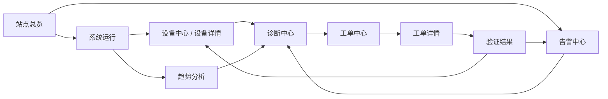
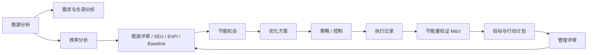

# 智慧能源系统页面体系与交互蓝图 v1

> **状态：SUPERSEDED / HISTORICAL — 已由 v2 替代**  
> **Superseded by:** `docs/product/smart-energy-system-page-architecture-v2.md`  
> **范围：企业级智慧能源 + HVAC 运行、能源绩效、优化控制与持续改进**  
> **设计输入声明：本文件不以当前项目已有页面、旧路由、旧菜单、旧设计稿、旧组件实现或旧信息架构为设计输入。**  
> 当前仓库中的既有页面只能在后续实施阶段作为“可复用业务能力 / 数据契约 / 已验证领域语义”的候选来源，**不能反向约束本文件的页面体系、页面职责和交互模型**。

---

## 1. 为什么重新定义页面体系

智慧能源系统不是“把设备、告警、能耗、报表分别做成几个后台页面”。一个成熟系统必须同时支持三类长期工作：

1. **运营闭环**：观察当前状态 → 发现异常 → 调查证据 → 建立责任 → 执行处理 → 验证结果。
2. **能源改进闭环**：计量 → 能源分析 → 识别重大用能和低效 → 形成节能机会 → 设计方案 → 执行 → Measurement & Verification → 持续改进。
3. **控制闭环**：理解当前控制状态 → 设计/审查策略 → 仿真与约束校验 → 审批 → 执行 → ACK / readback → 审计与回滚。

产品的信息架构必须围绕这些工作闭环，而不是围绕后端服务名、英文缩写或现有代码模块组织。

本蓝图参考的行业原则包括：

- ISO 50001 的 Energy Management System 持续改进思想：能源评审、重大能源使用、EnPI、基线、目标、行动计划、监测与改进。
- DOE 50001 Ready 对数据采集、系统/设备级分析、Significant Energy Uses、Relevant Variables、EnPI 与 Baseline 的任务划分。
- IPMVP 对节能量 Measurement & Verification 的基本原则：节能量不是可直接计量量，必须基于测量边界、基线、实施后测量和适当调整进行验证。
- ASHRAE Guideline 36 对高性能 HVAC 控制的核心思想：标准化运行序列、控制稳定性、能效、实时故障检测与功能验证。

这些原则决定了本产品必须把 **实际事实、检测结果、推断、建议、控制动作、已执行结果、已验证节能量** 分成不同产品语义，不能混成一个“AI 智能分数”。

---

# 2. 产品服务的主要用户

页面体系必须同时覆盖不同角色，但避免为每个角色复制一套页面。

| 用户 | 最重要的工作 | 主要页面 |
|---|---|---|
| 企业能源负责人 | 多站点能源绩效、目标、节能项目、管理复盘 | 企业总览、Energy Review、目标与行动计划、M&V、管理评审 |
| 站点能源经理 | 能源异常、效率、机会、方案与验证 | 站点总览、能源分析、效率分析、节能机会、优化方案、M&V |
| HVAC 值班 / 运行工程师 | 当前系统是否正常、哪里异常、如何继续调查 | 系统运行、趋势分析、告警、诊断、设备详情 |
| 维修 / 运维团队 | 哪些问题需要处理、谁负责、SLA 与结果证据 | 工单中心、工单详情、设备详情、告警、诊断 |
| 控制工程师 | 当前控制状态、策略、约束、执行与回读 | 控制中心、策略中心、策略详情、执行记录 |
| 数据 / 集成工程师 | 计量、点位、质量、接入与映射 | 数据质量、计量与语义模型、集成管理 |
| 系统管理员 | 站点、权限、规则、审计 | 站点与系统配置、规则与通知、用户权限与审计 |
| 管理层 | 绩效、风险、投入产出、是否真正产生节能 | 企业总览、管理评审、报告中心、M&V |

---

# 3. 产品的两个主闭环

## 3.1 运营闭环



关键规则：

- “告警被确认 / 指派 / 工单完成”不等于物理异常已经恢复。
- Diagnosis/FDD 的 Finding 不自动等于 Root Cause。
- Device Offline、Telemetry Stale、Data Quality Bad、Mechanical Fault 是不同事实。
- 任何跨页跳转必须保留当前 Site、时间窗口和选中对象上下文。

## 3.2 能源持续改进闭环



关键规则：

- Actual、Baseline、Forecast、Model Estimate、Verified Savings 必须是不同数据语义。
- Opportunity 是机会，不是批准后的控制动作。
- Expected Savings 是预测；Verified Savings 是 M&V 结果，不能互相替代。
- 控制动作必须能追溯到约束、审批、执行 ACK、readback 和审计。

---

# 4. 全产品页面总数与一级导航

本蓝图定义 **32 个产品页面**。其中 26 个为业务页面，6 个为平台 / 管理页面。

一级导航建议保持在 8 个业务域内，不把所有 32 页平铺到 Sidebar。

```text
企业
  企业总览
  站点总览

运行
  系统运行
  趋势分析
  设备中心

事件与工作
  告警中心
  诊断中心
  工单中心

能源绩效
  能源分析
  需求与负荷
  效率分析
  能源评审
  成本与电价
  碳排放

持续改进
  节能机会
  优化方案
  目标与行动计划
  节能量验证

控制与自动化
  控制中心
  策略中心
  执行记录

报告与管理
  报告中心
  管理评审

平台管理
  数据质量
  计量与语义模型
  规则与通知
  集成管理
  站点与系统配置
  用户、权限与审计
```

以下页面通常通过父页面进入，不需要都放在 Sidebar：

- 设备详情
- 工单详情
- 策略详情 / 仿真 / 审批

---

# 5. 32 个页面总表

| ID | 页面 | 业务域 | 默认进入方式 | 页面类型 |
|---|---|---|---|---|
| 01 | 企业总览 | 企业 | 登录 / 企业级入口 | Portfolio Workspace |
| 02 | 站点总览 | 企业 | 企业总览 / Site Selector | Site Workspace |
| 03 | 系统运行 | 运行 | 站点总览 | Live Operations Workspace |
| 04 | 趋势分析 | 运行 | 系统运行 / 设备 / 诊断 | Analytical Workspace |
| 05 | 设备中心 | 运行 | Sidebar / 系统运行 | Asset Ledger |
| 06 | 设备详情 | 运行 | 设备中心 / 告警 / 诊断 | Durable Detail |
| 07 | 告警中心 | 事件与工作 | Sidebar / 总览 | Triage Ledger |
| 08 | 诊断中心 | 事件与工作 | 告警 / 设备 / Sidebar | Investigation Workspace |
| 09 | 工单中心 | 事件与工作 | Sidebar / 告警 / 诊断 | Work Ledger |
| 10 | 工单详情 | 事件与工作 | 工单中心 | Durable Work Detail |
| 11 | 能源分析 | 能源绩效 | Sidebar / 总览 | Energy Analytical Workspace |
| 12 | 需求与负荷分析 | 能源绩效 | 能源分析 | Demand Workspace |
| 13 | 效率分析 | 能源绩效 | 能源分析 / 系统运行 | Engineering Analytical Workspace |
| 14 | 能源评审 / SEU / EnPI / Baseline | 能源绩效 | 能源分析 / 管理评审 | Energy Management Workspace |
| 15 | 成本与电价 | 能源绩效 | 能源分析 | Cost Analytical Workspace |
| 16 | 碳排放 | 能源绩效 | 能源分析 / 报告 | Carbon Workspace |
| 17 | 节能机会 | 持续改进 | 能源 / 效率 / 诊断 | Opportunity Ledger |
| 18 | 优化方案 | 持续改进 | 节能机会 | Engineering Proposal Detail |
| 19 | 目标与行动计划 | 持续改进 | 能源评审 / 管理评审 | Improvement Program Workspace |
| 20 | 节能量验证 M&V | 持续改进 | 优化方案 / 执行记录 | Verification Workspace |
| 21 | 控制中心 | 控制与自动化 | 系统运行 / Sidebar | Live Control Workspace |
| 22 | 策略中心 | 控制与自动化 | Sidebar | Strategy Ledger |
| 23 | 策略详情 / 仿真 / 审批 | 控制与自动化 | 策略中心 | Strategy Engineering Detail |
| 24 | 执行记录 | 控制与自动化 | 控制 / 策略 / 审计 | Immutable Execution Ledger |
| 25 | 报告中心 | 报告与管理 | Sidebar | Report Library |
| 26 | 管理评审 | 报告与管理 | Sidebar / 企业总览 | Management Workspace |
| 27 | 数据质量 | 平台管理 | 任意数据异常入口 / Sidebar | Data Observability Workspace |
| 28 | 计量与语义模型 | 平台管理 | 数据质量 / 配置 | Data Model Workspace |
| 29 | 规则与通知 | 平台管理 | 告警 / 配置 | Rule Administration |
| 30 | 集成管理 | 平台管理 | 配置 | Integration Workspace |
| 31 | 站点与系统配置 | 平台管理 | 配置 | Configuration Workspace |
| 32 | 用户、权限与审计 | 平台管理 | 配置 | Security & Audit Workspace |

---

# 6. 页面详细定义

## 01 企业总览

### 目的
让企业能源负责人和管理层在一分钟内回答：**哪些站点需要关注、能源表现如何、风险和节能机会在哪里。**

### 必须包含

- 企业范围 Site Selector / Region / Business Unit。
- 企业总能耗与需求趋势；必须可说明统计边界。
- 站点能源强度 / EnPI 对比，而不仅是绝对 kWh 排名。
- 站点运行风险摘要：重大告警、严重数据问题、关键工单 SLA。
- 节能机会组合：预计收益、风险、状态、责任人。
- 已实施项目的 Verified Savings，而不是把预计收益当成果。
- 目标完成度：能源目标、节能项目、碳目标（如启用）。
- 站点排名 / 异常站点列表，能够进入站点总览。

### 主要交互

- 点击站点 → **02 站点总览**。
- 点击能源偏差 → **11 能源分析**，携带站点与时间窗口。
- 点击低效站点 → **13 效率分析**。
- 点击机会 → **17 节能机会**。
- 点击已实施项目 → **20 M&V**。

### 不应该包含

- 单台设备实时控制。
- 大量原始点位。
- 用几十张 KPI Card 代替问题优先级。

---

## 02 站点总览

### 目的
成为一个站点的日常工作首页，回答：**现在需要关注什么、运行如何、能源如何、下一步去哪处理。**

### 必须包含

- 当前运行状态：主要系统运行模式、关键设备群状态。
- 当前异常：活动告警、未处理诊断、超时/未指派工单。
- 当前能源：今日/本周期能耗、当前需求、主要偏差。
- 当前效率：系统 COP / kW/RT / ΔT 等站点适用核心指标。
- 当前节能机会：只展示证据足够且排名靠前的项目。
- 数据可信度：关键数据覆盖、延迟、缺失。
- 最近重要变化：控制变更、重大告警、重要工单、策略发布。

### 主要交互

- 运行异常 → **03 系统运行**。
- 告警 → **07 告警中心**。
- 工单 → **09 工单中心**。
- 能耗偏差 → **11 能源分析**。
- 效率下降 → **13 效率分析**。
- 节能机会 → **17 节能机会**。
- 数据问题 → **27 数据质量**。

### 不应该包含

- 作为所有模块的快捷入口墙。
- 企业级多站点排名。
- 大量配置功能。

---

## 03 系统运行

### 目的
让运行工程师理解**HVAC 当前究竟怎样运行**。

### 必须包含

- 可切换系统域：冷源、冷冻水、冷却水、AHU / 末端、热源（如有）。
- 真实系统拓扑 / 运行关系；无关系数据时不能画假流向。
- 当前 operating mode、schedule、stage、setpoint、关键回路状态。
- 设备群运行 / 停机 / unavailable 数量。
- 关键工程参数：温度、压力、流量、阀位、频率、功率、COP 等。
- 当前异常和数据质量标记。
- Context Inspector：选中系统或设备时显示当前事实和调查入口。

### 主要交互

- 点击设备 → 快速 Inspector；持续调查 → **06 设备详情**。
- 点击参数 → **04 趋势分析**，自动携带对应点位。
- 点击告警 → **07 告警中心**。
- “为什么这样运行” → **08 诊断中心**。
- 有控制权限 → **21 控制中心**。
- 策略来源 → **23 策略详情**。

### 不应该包含

- 把图形拓扑本身当装饰。
- 在没有因果证据时画“影响箭头”。
- 在设备离线时显示伪实时值。

---

## 04 趋势分析

### 目的
提供工程级时序调查工具，而不是普通 BI 折线图。

### 必须包含

- 多点位 / 多设备 / 多系统选择。
- 时间范围与粒度。
- 单位、Y Axis、数据质量和采样语义。
- 同比 / 前一周期 / baseline overlay。
- 告警、控制动作、策略切换、运行模式变化事件标记。
- Zoom、brush、crosshair、区间统计。
- Min / Max / Avg / P95 / runtime 等适用统计。
- 导出调查上下文，而不是只导出截图。

### 主要交互

- 从 **03/06/08/11/13** 带点位与时间范围进入。
- 选中异常时间窗口 → 带时间窗口进入 **08 诊断中心**。
- 点击控制事件 → **24 执行记录**。

### 不应该包含

- 把不同单位无说明地画在一个轴。
- 缺失值自动补零。
- 默认无限堆积几十条曲线。

---

## 05 设备中心

### 目的
高效率扫描、过滤、比较企业真实资产与设备。

### 必须包含

- Table/Ledger First。
- 空间 / 系统 / 设备类型 / 连接 / 运行 / 数据质量筛选。
- 人可读设备名称、位置、类型。
- 运行状态、连接状态、数据新鲜度、数据质量分开显示。
- 关键当前值。
- 最后更新时间。
- 快速 Inspector。
- 批量操作只在业务确实允许时出现。

### 主要交互

- 行点击 → 同页 Inspector。
- 完整调查 → **06 设备详情**。
- 数据异常 → **27 数据质量**。
- 活动告警 → **07 告警中心**。
- 诊断 Finding → **08 诊断中心**。

### 不应该包含

- UUID / traceId 作为主显示信息。
- 一个模糊的“设备健康 87 分”替代真实状态。
- 默认卡片墙。

---

## 06 设备详情

### 目的
承载单个设备的持续调查和完整业务上下文。

### 必须包含

- 身份：名称、类型、位置、系统归属。
- 当前运行与连接事实。
- 关键实时/最近值与最后有效时间。
- 趋势快捷区。
- 活动 / 历史告警。
- 诊断 Findings。
- 相关工单与维护历史。
- 控制能力与当前 mode/setpoint（有权限时）。
- 数据质量 / 点位覆盖。
- 关联资产、上游/下游关系（只有真实关系存在时）。

### 主要交互

- 参数趋势 → **04 趋势分析**。
- 告警 → **07 告警中心**。
- Finding → **08 诊断中心**。
- 工单 → **10 工单详情**。
- 控制 → **21 控制中心**。

---

## 07 告警中心

### 目的
处理“当前发生了什么，需要谁负责”。

### 必须包含

- Current Active 为默认主视图。
- Severity、Condition、handling status、owner、duration、repeat、source、suppression 分开。
- 搜索与过滤。
- Triage Ledger。
- 同页 Context Inspector。
- ACK、Assign、Suppress 等真实处理动作。
- Recovered / History 为次级视图。
- Correlation 只表示关联，不自动表示根因。

### 主要交互

- 告警设备 → **06 设备详情**。
- 深入原因 → **08 诊断中心**。
- 建立责任 → **09 工单中心 / 10 工单详情**。
- 告警趋势证据 → **04 趋势分析**。

### 关键语义

- ACK ≠ CLEARED。
- Assign ≠ CLEARED。
- Work Order Complete ≠ CLEARED。
- 物理恢复由实际规则/状态判定。

---

## 08 诊断中心

### 目的
回答“为什么可能发生”，并严格区分事实、Finding、Hypothesis、Root Cause。

### 必须包含

- Investigation Queue。
- 症状与已验证事实。
- 证据时间窗口。
- Published deterministic/model Finding。
- Root Cause Hypotheses。
- 每个假设的 supporting / contradicting evidence。
- Confidence 的来源与含义。
- 影响范围。
- 下一验证步骤。
- 关联告警、设备、工单、控制事件。
- Investigation Timeline。

### 主要交互

- 时间证据 → **04 趋势分析**。
- 设备 → **06 设备详情**。
- 需要现场验证 → **09 工单中心**。
- 发现可重复节能问题 → **17 节能机会**。

### 不应该包含

- 把 Rule Hit 当 Root Cause。
- 把 correlation 当 causality。
- AI 生成的原因不带证据就显示成确定事实。

---

## 09 工单中心

### 目的
将问题变成明确责任、SLA、下一动作与可验证结果。

### 必须包含

- Work Ledger。
- Source：告警 / 诊断 / 巡检 / 计划 / 节能项目。
- Priority。
- State。
- Owner。
- SLA / overdue。
- Next Action。
- Due Date。
- Blocked 状态。
- “完成但未验证”的独立状态/事实。

### 主要交互

- 选中 → 同页 Inspector。
- 深入执行 → **10 工单详情**。
- 回到来源告警 / 诊断 / 设备。

---

## 10 工单详情

### 目的
承载真正的维护执行过程，而不是一个表单详情页。

### 必须包含

- Problem Statement。
- Source Evidence。
- Owner / team / SLA。
- Task checklist。
- Timeline。
- Field Notes。
- Attachments / photos / documents。
- Parts / external dependency（如果产品支持）。
- Execution Evidence。
- Completion Evidence。
- Verification Result。
- Reopen / follow-up 的真实业务记录。

### 主要交互

- Source → 告警 / 诊断 / 设备。
- 完成后需要确认物理状态时 → 告警 / 设备。
- 与节能措施相关时 → **20 M&V**。

---

## 11 能源分析

### 目的
回答“能源用了多少、什么时候用、用在哪里、为什么变化”。

### 必须包含

- 时间范围。
- Energy Type。
- Actual Consumption。
- Actual Demand。
- Previous Period / Baseline / Budget 比较。
- 主要负荷曲线。
- System / Space / Asset / Meter Breakdown。
- Variance periods。
- 关键贡献者排名。
- 与运行事件的时间关联。

### 主要交互

- Peak → **12 需求与负荷**。
- 低效贡献者 → **13 效率分析**。
- 设备 → **06 设备详情**。
- Opportunity → **17 节能机会**。
- 数据异常 → **27 数据质量**。

### 不应该包含

- Year / Month / Week / Day 分成四个独立页面。
- Forecast 冒充 Actual。
- 没有电价数据却显示“节省 ¥xxx”。

---

## 12 需求与负荷分析

### 目的
专门分析 Demand、Peak、Load Shape 和 Demand Response。

### 必须包含

- Demand time series。
- Peak demand 与 peak interval。
- Load duration curve。
- 峰值贡献设备 / 系统。
- Demand Charge window（有 tariff 时）。
- Scheduled vs unexpected peak。
- Demand response 事件。
- 可移峰 / 削峰负荷候选。

### 主要交互

- 峰值贡献者 → **13 效率分析 / 06 设备详情**。
- 可削峰机会 → **17 节能机会**。
- 电费影响 → **15 成本与电价**。

---

## 13 效率分析

### 目的
解释“同样完成业务负荷，系统做得是否高效”。

### 必须包含

- System COP。
- kW/RT 或其他明确 denominator 的 EnPI。
- 主机 COP。
- Pump transport efficiency。
- ΔT。
- Cooling tower approach。
- Subsystem comparison。
- Equipment ranking。
- Load vs Efficiency scatter。
- Weather / load / mode context。
- Invalid prerequisite 时显示 insufficient data。

### 主要交互

- Outlier → **06 设备详情**。
- 时间异常 → **04 趋势分析**。
- 原因调查 → **08 诊断中心**。
- 节能潜力 → **17 节能机会**。

### 不应该包含

- 自创“综合效率健康分”。
- 不同口径设备直接排名。

---

## 14 能源评审 / SEU / EnPI / Baseline

### 目的
承载 ISO 50001 风格的正式 Energy Review，而不是临时图表。

### 必须包含

- Energy Sources。
- Energy Uses。
- Significant Energy Uses (SEU)。
- Relevant Variables。
- Energy Performance Indicators (EnPI)。
- Energy Baseline (EnB)。
- Baseline period。
- Baseline model / normalization method。
- Baseline validity / version / change reason。
- SEU owner。
- Data sufficiency。
- 改进优先级。

### 主要交互

- SEU 分析 → **11/13**。
- Baseline 变化 → **27 数据质量** 或数据模型。
- 形成目标 → **19 目标与行动计划**。
- 形成机会 → **17 节能机会**。
- 验证节能 → **20 M&V**。

---

## 15 成本与电价

> 只有在真实 Tariff / Billing 数据接入后启用。

### 必须包含

- Tariff version 与有效期。
- TOU periods。
- Demand charge。
- Fixed / variable charge。
- Cost allocation。
- Actual billed / estimated cost 明确区分。
- Cost by system/site/business unit。
- Peak cost driver。
- Cost forecast 必须明确 Forecast 标签。

### 主要交互

- 需量费用 → **12 需求与负荷**。
- 高费用负荷 → **11/13**。
- Cost saving opportunity → **17**。

---

## 16 碳排放

> 只有在排放因子与计量边界明确时启用。

### 必须包含

- Energy source。
- Emission factor source / version / date。
- Scope / boundary。
- Location-based / market-based（适用时）。
- Actual emissions。
- Intensity metric。
- Trend。
- Reduction target。
- Verified project contribution。

### 不应该包含

- 没有因子版本或来源的“碳减排数字”。

---

## 17 节能机会

### 目的
建立“值得工程评审的机会池”。

### 必须包含

- Opportunity Ledger。
- 来源：能源、效率、诊断、人工发现。
- Verified Evidence Scope。
- Expected Benefit。
- Calculation Basis。
- Confidence / model source（适用时）。
- Affected systems。
- Constraints。
- Risk。
- Review status。
- Next Action。

### 主要交互

- 证据 → **04 / 11 / 13**。
- 受影响设备 → **06**。
- Review 后创建 → **18 优化方案**。

### 关键语义

- Opportunity ≠ Approved Change。
- Expected Saving ≠ Verified Saving。
- Evidence insufficient → 不显示成 Ready to Execute。

---

## 18 优化方案

### 目的
把节能机会升级为可评审、可审批、可回滚的工程 Change Proposal。

### 必须包含

- Objective。
- Current State。
- Proposed Change。
- Affected Scope。
- Preconditions。
- Constraints / safety limits。
- Simulation / what-if result。
- Expected Energy Benefit。
- Expected Cost Benefit（有 tariff 时）。
- Comfort / reliability impact。
- Risk assessment。
- Test plan。
- Rollback plan。
- Approval chain。
- Planned execution window。

### 主要交互

- 需要自动化实施 → **23 策略详情**。
- 需要人工任务 → **09/10 工单**。
- 执行后 → **20 M&V**。

---

## 19 目标与行动计划

### 目的
管理正式能源绩效目标，而不是临时 TODO。

### 必须包含

- Objective / Target。
- Baseline / EnPI reference。
- Target value。
- Due date。
- Owner。
- Scope。
- Action Plans。
- Related Opportunities / Optimization Plans。
- Budget / resource（如产品支持）。
- Progress。
- Risks / blockers。
- Verified results。

### 主要交互

- 指标来源 → **14 Energy Review**。
- Action → **18 Optimization / 09 Work Orders**。
- 结果 → **20 M&V**。
- 管理层复盘 → **26 管理评审**。

---

## 20 节能量验证 M&V

### 目的
回答“措施执行后到底省了多少”，并保存可审计方法。

### 必须包含

- Measurement boundary。
- Baseline period。
- Reporting period。
- Baseline model。
- Independent variables / relevant variables。
- Adjustments。
- Excluded periods。
- Actual consumption。
- Adjusted baseline consumption。
- Verified savings。
- Cost savings（有 tariff 时）。
- Uncertainty / model quality。
- M&V Plan。
- Evidence / approval。

### 主要交互

- 回到实施方案 → **18**。
- 执行证据 → **24**。
- Data issue → **27**。
- 结果进入 → **19 / 25 / 26**。

### 不应该包含

- `Baseline - Actual` 不经调整就一律叫 Verified Savings。

---

## 21 控制中心

### 目的
显示当前真实控制状态，并执行经过授权的即时控制。

### 必须包含

- Current operating mode。
- Active setpoints。
- Schedule state。
- Overrides。
- Control authority source：manual / strategy / schedule / safety。
- Available commands。
- Interlock / prerequisite。
- Confirmation。
- Command status。
- ACK / readback。
- Expiry for overrides。

### 主要交互

- 控制对象 → **06 设备详情**。
- 控制来源策略 → **23 策略详情**。
- 每一次动作 → **24 执行记录**。

### 不应该包含

- “发送成功”就等于设备已执行。
- 隐藏安全 interlock。

---

## 22 策略中心

### 目的
管理长期自动化控制策略组合。

### 必须包含

- Strategy Ledger。
- Scope。
- Status：draft / review / approved / active / paused / retired。
- Strategy type。
- Schedule。
- Priority。
- Conflicts。
- Last execution。
- Current effectiveness。
- Version。

### 主要交互

- 点击策略 → **23 策略详情**。
- 查看执行 → **24 执行记录**。
- 由优化方案创建策略 → **18 → 23**。

---

## 23 策略详情 / 仿真 / 审批

### 目的
把控制逻辑变成可理解、可验证、可发布的工程对象。

### 必须包含

- Strategy objective。
- Scope。
- Trigger / schedule。
- Inputs。
- Outputs。
- Preconditions。
- Guardrails。
- Priority / conflict policy。
- Fail-safe behavior。
- Simulation。
- Historical replay（如果具备可信数据）。
- Expected impact。
- Version diff。
- Approval。
- Rollout plan。
- Rollback plan。

### 主要交互

- 发布 → **24 执行记录**。
- 运行影响 → **03 / 13**。
- 节能验证 → **20**。

---

## 24 执行记录

### 目的
提供控制领域不可含糊的事实 Ledger。

### 必须包含

- Requested At。
- Requested By。
- Source strategy / manual / external system。
- Target object。
- Intended command。
- Authorization / approval。
- Attempt。
- Gateway delivery result。
- Device ACK。
- Readback。
- Final execution result。
- Failure reason。
- Rollback / override。
- Correlation to Optimization / Strategy / Work Order。

### 不应该包含

- 把 Intent、Attempt、ACK、Readback 合成一个“成功”状态。

---

## 25 报告中心

### 目的
生成可复用、可审计、可定时的业务报告。

### 必须包含

- Report Templates。
- Site / portfolio scope。
- Reporting period。
- Data completeness indicator。
- Generated reports。
- Scheduled reports。
- Distribution recipients。
- Version / generated time。
- Drill-back links to source analysis。

### 典型报告

- 站点运行日报。
- 能源周报 / 月报。
- 告警与维护报告。
- 能效分析报告。
- 节能项目 M&V 报告。
- 管理层能源绩效报告。

---

## 26 管理评审

### 目的
支持 ISO 50001 风格管理层周期性复盘，回答“绩效是否真的改善，哪里需要资源和决策”。

### 必须包含

- Energy policy / objective status。
- EnPI & baseline performance。
- Target progress。
- SEU changes。
- Verified savings。
- Significant deviations。
- Major operational risks。
- Data quality risks。
- Open improvement actions。
- Resource / investment decisions。
- Previous management actions status。

### 主要交互

- 指标 → **14**。
- 项目 → **18 / 20**。
- 目标 → **19**。
- 报告输出 → **25**。

---

## 27 数据质量

### 目的
让系统明确告诉用户“哪些结论值得信、哪些数据有问题”。

### 必须包含

- Coverage。
- Freshness。
- Completeness。
- Suspect / invalid。
- Time synchronization。
- Unit / scale anomalies。
- Meter gaps。
- Point gaps。
- Data source health。
- Affected analytics / rules / opportunities。
- Incident timeline。

### 主要交互

任何业务页面发现数据问题，都应直接 deep-link 到本页，并自动带上：

- Site
- meter / point / device
- time window
- impacted calculation

---

## 28 计量与语义模型

### 目的
建立能源系统的可信对象关系，而不是让每个页面自己猜测设备含义。

### 必须包含

- Site / building / floor / zone。
- HVAC system hierarchy。
- Asset / device / sensor / point。
- Meter hierarchy。
- Energy source。
- Meter-to-load allocation。
- Point semantic tags。
- Unit / engineering range。
- Transform / calculated point。
- Virtual meter。
- Relationship graph。
- Effective dates / version。

### 主要交互

- 数据质量 → 定位映射问题。
- 能源分析 → 显示 calculation lineage。
- 设备中心 → 业务对象关系。

---

## 29 规则与通知

### 目的
管理检测规则和通知路由，不承担日常告警处置。

### 必须包含

- Alarm / diagnostic rule definitions。
- Scope。
- Threshold / condition / hysteresis。
- Delay / debounce。
- Recovery condition。
- Severity mapping。
- Notification policy。
- Escalation。
- Maintenance windows / suppression policy。
- Rule version。
- Test / preview。
- Change approval / audit。

### 不应该包含

- 直接作为活动告警中心使用。

---

## 30 集成管理

### 目的
管理外部数据和控制连接的生命周期。

### 必须包含

- BMS / BACnet / Modbus / MQTT / API / external EMS connectors。
- Connection health。
- Authentication state。
- Data sync lag。
- Last successful sync。
- Mappings。
- Error queue / dead letter（适用时）。
- Rate / volume。
- Capability：read-only / command / event。
- Test connection。
- Change audit。

---

## 31 站点与系统配置

### 目的
定义业务范围和运行日历，而不是配置每个页面的视觉参数。

### 必须包含

- Organization / portfolio structure。
- Sites。
- Buildings / spaces。
- HVAC system definitions。
- Equipment templates / classes。
- Operating calendar。
- Timezone。
- Weather station association。
- Business calendar / holidays。
- Site commissioning state。

---

## 32 用户、权限与审计

### 目的
集中管理安全授权与关键业务操作审计。

### 必须包含

- Users。
- Groups。
- Roles。
- Site scope。
- Capability / permission matrix。
- Approval authority。
- Sensitive control permission。
- Session / access review（适用时）。
- Audit events。
- Export / review。

### 关键原则

- “能看设备”与“能控制设备”不是同一权限。
- “能编辑策略”与“能批准发布”不是同一权限。
- 审计事件必须使用人可理解的业务语义，同时保留内部证据标识供追踪。

---

# 7. 页面之间必须怎样交互

## 7.1 站点上下文

除 01 企业总览外，所有业务页面都必须有明确 Site Context。

从一个站点页面跳转到另一个站点页面时，默认保留 `site`，不重新让用户选择。

## 7.2 时间上下文

分析型页面之间应保留时间窗口：

```text
能源分析
  → 效率分析
  → 趋势分析
  → 诊断中心
```

如果用户从 14:00–16:00 的异常窗口进入下一页，下一页默认仍然查看 14:00–16:00，而不是回到“今天”。

## 7.3 对象上下文

跨页调查必须携带业务对象：

```text
设备详情
  device
  site
  time range

告警中心
  alarm
  device
  site
  occurrence window

诊断中心
  finding / investigation
  evidence window
  asset/device
```

内部 object id 可以存在于 URL / request / audit，但主 UI 显示业务名称。

## 7.4 Compare / Baseline 上下文

从能源分析进入效率分析时，应保留：

- actual period
- comparison type
- baseline version（如果有）
- grouping scope

不能在下一页悄悄换一个 baseline。

## 7.5 Quick Inspect 与 Durable Detail

产品统一采用：

```text
扫描 / Ledger / Topology
  ↓ 点击对象
Context Inspector
  ↓ 需要持续调查
Durable Detail Route
```

Inspector 用于快速判断，不承载所有复杂操作。

## 7.6 返回来源

从 Alarm → Diagnosis → Work Order 深入调查时，页面应显示调查链路，并允许返回来源，而不是依赖浏览器 Back 猜上下文。

---

# 8. 全局 Shell 应该有什么

所有业务页面共享一个稳定 App Shell。

## 必须包含

- Product / organization identity。
- Portfolio / Site Selector。
- Global Search / Command Search。
- 当前站点与时间上下文提示。
- Notification / task indicator。
- 用户与权限入口。
- Help / documentation。

## AI 的位置

**AI 不作为一级业务页面。**

它是跨页面能力：

- 在当前上下文解释事实。
- 帮助组合调查问题。
- 生成查询 / 趋势组合。
- 草拟诊断 Hypothesis。
- 草拟工单说明。
- 草拟节能 Opportunity / Optimization Plan。
- 总结 Report。

但 AI 不能：

- 把建议写成权威事实。
- 静默执行高风险控制。
- 伪造节能收益。
- 跳过 evidence / approval / audit。

---

# 9. 所有页面共用的数据语义规则

## 9.1 不能混淆的事实

必须分别呈现：

- Asset identity
- Device connectivity
- Operating state
- Telemetry freshness
- Telemetry quality
- Alarm physical condition
- Alarm handling state
- Diagnostic finding
- Root-cause hypothesis
- Work execution state
- Control command intent
- Control delivery
- Device ACK
- Readback
- Expected savings
- Verified savings

## 9.2 “未知”不是 0

- Pending ≠ 0
- No Data ≠ 0
- Unavailable ≠ 0
- Not Authorized ≠ No Data
- Stale ≠ Current
- Forecast ≠ Actual

## 9.3 时间必须可追溯

实时 / 当前值至少应该能知道：

- observation time
- freshness
- source / watermark（需要时）

历史 / 聚合值必须能知道统计周期。

---

# 10. 页面视觉与信息密度原则

本文件不定义具体 UI 风格，但定义页面结构原则。

## 10.1 Facts before decoration

先告诉用户真实事实、异常和下一动作，再考虑视觉表现。

## 10.2 不做 KPI Card Wall

四五个 headline facts 可以使用 compact facts strip，但不能把每个数字都做成一个独立大卡片。

## 10.3 Ledger First

以下页面默认以高密度可扫描 Ledger/Table 为主：

- 设备中心
- 告警中心
- 工单中心
- 节能机会
- 策略中心
- 执行记录

## 10.4 Analysis Workspace First

以下页面以时间与对比上下文 + 主分析图 + Contributor / Evidence 为主：

- 趋势分析
- 能源分析
- 需求与负荷
- 效率分析
- M&V

## 10.5 Context Inspector

Inspector 应该告诉用户：

- 当前选中了什么
- 关键事实
- 为什么需要关注
- 下一步可以去哪

而不是复制完整详情页。

---

# 11. 页面状态模型

每个业务页面和主要区块都必须区分：

1. Loading
2. Ready with data
3. Ready but empty
4. Partial data
5. Stale
6. Data quality suspect
7. Owner unavailable
8. Not integrated
9. Not authorized
10. Request failed

不能把这些状态统一显示成“暂无数据”。

---

# 12. 条件性页面

以下页面只有在数据和业务能力存在时才显示在导航：

- **15 成本与电价**：需要真实 Tariff / Billing Model。
- **16 碳排放**：需要可审计 emission factor 与边界。
- **21–24 控制与自动化**：只对有控制能力和权限的站点/用户显示对应能力。

不存在的能力不应该用 disabled 菜单长期占位。

---

# 13. 推荐实施顺序（Greenfield）

这不是基于当前代码迁移难度，而是基于产品价值和依赖关系。

## Phase A — 运行闭环

优先建立用户每天工作的主干：

```text
02 站点总览
03 系统运行
04 趋势分析
05 设备中心
06 设备详情
07 告警中心
08 诊断中心
09 工单中心
10 工单详情
27 数据质量
```

## Phase B — 能源绩效

```text
11 能源分析
12 需求与负荷
13 效率分析
14 Energy Review / SEU / EnPI / Baseline
17 节能机会
```

## Phase C — 改进闭环

```text
18 优化方案
19 目标与行动计划
20 M&V
25 报告中心
26 管理评审
```

## Phase D — 控制闭环

```text
21 控制中心
22 策略中心
23 策略详情 / 仿真 / 审批
24 执行记录
```

## Phase E — 企业与平台扩展

```text
01 企业总览
15 成本与电价
16 碳排放
28 计量与语义模型
29 规则与通知
30 集成管理
31 站点与系统配置
32 用户、权限与审计
```

---

# 14. 设计页面时的强制问题

后续任何一个页面进入 wireframe / UI 设计前，都必须先回答以下问题：

1. **这个页面帮助哪个角色完成哪一个 Job？**
2. **用户进入页面后的第一个问题是什么？**
3. **页面最重要的三个事实是什么？**
4. **什么情况需要用户采取行动？**
5. **下一步动作应该跳到哪个页面？**
6. **需要保留哪些 Site / Time / Object / Comparison 上下文？**
7. **哪些数据是 authoritative actual，哪些是 model / baseline / forecast / suggestion？**
8. **哪些状态如果没有数据必须显示 unavailable，而不是 0？**
9. **什么内容应该留在 Inspector，什么内容必须进入 durable detail？**
10. **这个页面明确不负责什么？**

没有回答这些问题，不开始组件设计。

---

# 15. 后续页面设计文档模板

每一个页面都应再生成独立 Surface Specification，结构统一为：

```text
Page name
User jobs
Primary questions
Entry points
Exit paths
Information hierarchy
Primary facts
Actions
Filters / search state
Inspector model
Durable detail model
Data authority
State semantics
Cross-page context contract
Permission boundary
Desktop layout
Narrow layout
Empty / partial / unavailable states
Browser acceptance criteria
```

这份模板比“先画一个页面再解释它是什么”更重要。

---

# 16. 本蓝图明确不采用的产品组织方式

以下方式不作为新的智慧能源系统信息架构：

- 按后端服务名组织导航。
- 把 FDD、Forecast、AI、Dashboard 当作天然一级业务域。
- 按“年 / 月 / 周 / 日”拆成四个能源页面。
- 一个首页塞满所有模块入口。
- 为每一种设备类型创建完全不同的页面体系。
- 把所有详情都塞进 Drawer。
- 把所有分析都做成通用 BI Dashboard。
- 通过大量 KPI 卡片制造“智慧感”。
- 把 AI 输出和实际传感器事实放在同一个视觉层级。
- 通过一个健康分掩盖 Connectivity、Freshness、Quality、Alarm、Diagnosis 等不同事实。

---

# 17. 参考标准与行业依据

本蓝图的工作闭环和产品语义主要参考：

- ISO 50001:2018 — Energy management systems — Requirements with guidance for use  
  https://www.iso.org/standard/69426.html
- U.S. DOE 50001 Ready — Energy Management System implementation guidance，尤其是 Data Collection、Data Analysis、SEU、Relevant Variables、EnPI、Baselines / Objectives / Targets  
  https://betterbuildingssolutioncenter.energy.gov/
- Efficiency Valuation Organization — IPMVP，Measurement & Verification 基本框架  
  https://evo-world.org/en/products-services-mainmenu-en/protocols/ipmvp
- ASHRAE Guideline 36 — High-Performance Sequences of Operation for HVAC Systems  
  https://www.ashrae.org/technical-resources/standards-and-guidelines/titles-purposes-and-scopes

---

# 18. 最终结论

一个成熟智慧能源系统不应该被理解成“10 个漂亮页面”，而应该是一套覆盖 **观察、调查、维护、能源绩效、持续改进、控制、验证和治理** 的工作系统。

本蓝图定义的 **32 个页面** 是完整企业级产品边界：

```text
2   企业 / 站点总览
4   运行页面
4   事件与工作页面
6   能源绩效页面
4   持续改进页面
4   控制与自动化页面
2   报告与管理页面
6   平台与治理页面
----------------
32  页面
```

下一阶段不应该立即“把 32 页全部画出来”。正确流程是：

1. 先冻结本页面体系与交互关系。
2. 再定义 Global Shell、导航和跨页 Context Contract。
3. 从运营闭环 Phase A 开始，为每页写 Surface Specification。
4. 再做 wireframe。
5. 最后进入 UI Component Mapping 和代码实现。

只有这样，最终系统才会像一个完整的智慧能源产品，而不是一组相互孤立的后台页面。
