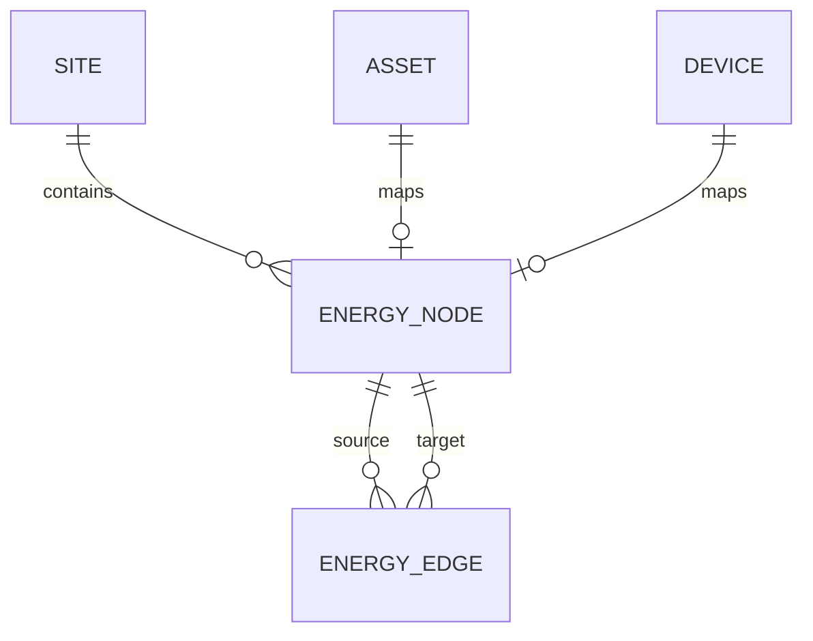
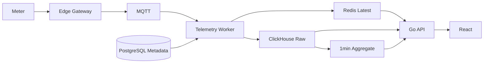

# 智慧能源系统 ER 模型与数据库表结构设计

> 版本：V2.0  
> 技术基线：PostgreSQL + ClickHouse + Redis + MQTT  
> 适用阶段：总体设计 / 详细设计 / 第一阶段工程实施  
> 设计原则：PostgreSQL 管理强事务与主数据，ClickHouse 管理海量时序事实，Redis 管理最新值与运行态

---

# 1. 设计目标

本数据库设计需要同时满足：

```text
多租户
多站点
空间与资产树
设备与点位标准化
能源拓扑
高频时序数据
指标计算
告警
控制
费用
预测与优化
审计与追溯
```

数据库不采用“所有数据放一个库”的设计。

最终职责：

```text
PostgreSQL
├─ IAM / Tenant
├─ Site / Space / Asset
├─ Gateway / Product / Device / Point
├─ Energy Topology
├─ Metric Definition
├─ Alarm / Rule
├─ Command / Safety
├─ Tariff / Carbon
├─ Audit
└─ Configuration

ClickHouse
├─ Numeric Telemetry
├─ State Telemetry
├─ High-density Battery Cell Telemetry
├─ Rollup
├─ Metric Series
├─ Data Quality Aggregate
└─ Historical Analytics

Redis
├─ Latest Point
├─ Gateway State
├─ Device State
├─ Rule Runtime State
└─ Realtime Cache
```

---

# 2. ER 总体关系

智慧能源系统核心实体链：

```text
Tenant
  ↓
Site
  ↓
Space
  ↓
Asset
  ↓
Device
  ↓
Point
  ↓
Telemetry
  ↓
Metric
```

同时存在三类重要横向关系：

```text
Energy Topology
Alarm/Event
Control Command
```

完整逻辑关系：

```mermaid
erDiagram
    TENANT ||--o{ APP_USER : owns
    TENANT ||--o{ SITE : owns
    TENANT ||--o{ ROLE : owns

    SITE ||--o{ SPACE : contains
    SITE ||--o{ ASSET : contains
    SITE ||--o{ GATEWAY : contains
    SITE ||--o{ DEVICE : contains
    SITE ||--o{ ENERGY_NODE : contains

    SPACE ||--o{ SPACE : parent_child
    SPACE ||--o{ ASSET : locates

    ASSET_TYPE ||--o{ ASSET : classifies
    ASSET ||--o{ ASSET : parent_child
    ASSET ||--o{ DEVICE : binds

    GATEWAY ||--o{ DEVICE : connects
    DEVICE_PRODUCT ||--o{ DEVICE : instantiates
    DEVICE_PRODUCT ||--o{ POINT_TEMPLATE : defines
    DEVICE ||--o{ POINT : owns
    POINT_TEMPLATE ||--o{ POINT : instantiates

    ENERGY_NODE ||--o{ ENERGY_EDGE : from
    ENERGY_NODE ||--o{ ENERGY_EDGE : to

    METRIC_DEFINITION ||--o{ METRIC_DEPENDENCY : depends
    METRIC_DEFINITION ||--o{ METRIC_BINDING : binds

    ALARM_RULE ||--o{ ALARM : triggers
    ALARM ||--o{ ALARM_HISTORY : has

    DEVICE ||--o{ COMMAND : target
    APP_USER ||--o{ COMMAND : requests
```

---

# 3. PostgreSQL Schema 分层

推荐逻辑 Schema：

```text
iam
core
iot
energy
ops
control
analytics
```

第一阶段可以先使用单一默认 schema，表名保持清晰；当系统成熟后再物理拆分。

逻辑映射：

| Schema | 核心职责 |
|---|---|
| iam | tenant / user / role / permission |
| core | site / space / asset / tag |
| iot | gateway / product / device / point |
| energy | energy topology / tariff / carbon |
| ops | event / alarm / maintenance |
| control | command / safety / override |
| analytics | metric definition / binding / forecast / optimization |

---

# 4. Tenant 与 IAM

## 4.1 tenant

用途：

```text
平台最高业务隔离边界
```

核心字段：

| 字段 | 类型 | 说明 |
|---|---|---|
| id | BIGSERIAL | 内部主键 |
| public_id | UUID | API 外部 ID |
| tenant_code | VARCHAR(64) | 租户编码 |
| name | VARCHAR(128) | 名称 |
| status | VARCHAR(32) | ACTIVE / DISABLED |
| timezone | VARCHAR(64) | 默认时区 |
| currency | VARCHAR(16) | 默认币种 |
| country | VARCHAR(8) | 国家 |
| created_at | TIMESTAMPTZ | 创建时间 |
| updated_at | TIMESTAMPTZ | 更新时间 |

约束：

```text
UNIQUE(tenant_code)
```

---

## 4.2 app_user

关系：

```text
Tenant 1 ── N User
```

核心字段：

```text
id
public_id
tenant_id
username
display_name
email
status
external_subject
created_at
updated_at
```

---

## 4.3 role / permission / user_role / role_permission

权限体系：

```text
User
 ↓
Role
 ↓
Permission
```

业务授权建议最终细化为：

```text
Tenant Scope
Site Scope
Asset Scope
Operation
Control Risk
```

---

# 5. Site 与空间模型

## 5.1 site

Site 是能源业务最重要的聚合边界。

典型：

```text
工业园区
工厂
商业综合体
数据中心
微电网
校园
```

字段：

```text
id
public_id
tenant_id
site_code
name
site_type
timezone
latitude
longitude
area_m2
status
metadata
```

约束：

```text
UNIQUE(tenant_id, site_code)
```

---

## 5.2 space

空间树：

```text
Site
└─ Building
   └─ Floor
      └─ Room
```

字段：

```text
id
public_id
tenant_id
site_id
parent_id
space_code
name
space_type
area_m2
sort_order
status
metadata
```

`parent_id` 自关联。

---

# 6. Asset 模型

## 6.1 asset_type

描述资产分类。

例如：

```text
TRANSFORMER
ELECTRIC_METER
PV_SYSTEM
PV_INVERTER
ESS
PCS
BMS
BATTERY_RACK
BATTERY_PACK
EV_CHARGER
HVAC
PUMP
CHILLER
```

---

## 6.2 asset

Asset 表示“业务资产”。

不是协议设备。

例如：

```text
500kW储能系统
1MW屋顶光伏
1号变压器
总进线电表
冷水机组
```

字段：

```text
id
public_id
tenant_id
site_id
space_id
parent_id
asset_type_id
asset_code
name
manufacturer
model
rated_power_kw
capacity_kwh
commission_date
status
metadata
```

自关联：

```text
Asset Parent
→ Asset Child
```

例如：

```text
ESS
├─ PCS
├─ BMS
└─ Battery Rack
```

---

# 7. Asset 与 Device 的区别

必须明确：

```text
Asset = 业务对象

Device = 可通信设备
```

例如：

```text
资产:
储能系统ESS-01
```

下面可能对应：

```text
PCS Device
BMS Device
Meter Device
Fire Control Device
```

所以关系：

```text
Asset 1 ── N Device
```

但允许：

```text
Device.asset_id = NULL
```

用于暂未绑定业务资产的设备。

---

# 8. Gateway

Gateway 是现场边缘通信节点。

关系：

```text
Site
 ↓
Gateway
 ↓
Device
```

字段：

```text
id
public_id
tenant_id
site_id
gateway_code
name
serial_number
software_version
config_version
online_status
last_seen_at
metadata
```

---

# 9. Device Product

Device Product 表示某厂家某型号设备模板。

例如：

```text
VendorA
PCS-X1000
```

字段：

```text
id
manufacturer
product_code
product_name
device_type
model
protocol
template_version
status
metadata
```

生命周期：

```text
DRAFT
→ TESTING
→ RELEASED
→ DEPRECATED
```

---

# 10. Point Template

Point Template 是产品级标准点位模板。

关系：

```text
Device Product
  ↓
Point Template
```

字段：

```text
product_id
vendor_code
point_code
point_name
point_type
raw_data_type
standard_data_type
raw_unit
standard_unit
access_type
sampling_interval_ms
min_value
max_value
multiplier
offset_value
protocol_address
byte_order
enum_mapping
dimensions
metadata
```

---

# 11. Device

Device 是现场可通信实例。

字段：

```text
id
public_id
tenant_id
site_id
asset_id
space_id
product_id
gateway_id
protocol_profile_id
device_code
name
device_type
manufacturer
model
serial_number
protocol
protocol_address
firmware_version
control_mode
online_status
last_seen_at
enabled
metadata
```

控制模式：

```text
LOCAL
REMOTE_MANUAL
REMOTE_AUTO
MAINTENANCE
LOCKED
```

---

# 12. Point

Point 是运行时标准点位实例。

关系：

```text
Device
 ↓
Point
```

字段：

```text
id
public_id
tenant_id
site_id
device_id
template_id
point_code
point_name
point_type
data_type
unit
access_type
sampling_interval_ms
min_value
max_value
multiplier
offset_value
enabled
dimensions
metadata
```

约束重点：

```text
(device_id, point_code, dimensions)
```

必须唯一。

---

# 13. Point 与 Telemetry 的关系

Point 在 PostgreSQL。

Telemetry 在 ClickHouse。

跨库通过：

```text
point.id
```

统一使用：

```text
PostgreSQL BIGINT
↓
ClickHouse UInt64
```

因此：

```text
PostgreSQL point.id
=
ClickHouse telemetry_numeric.point_id
```

不再需要数据库级 FK。

完整性由应用层保证。

---

# 14. Energy Topology

能源业务不能只依赖 Asset Tree。

Asset Tree 表示：

```text
“是什么”
```

Energy Topology 表示：

```text
“能源怎么流”
```

---

# 15. energy_node

节点类型示例：

```text
GRID
LOAD
METER
PV
ESS
EV
HVAC
BUS
TRANSFORMER
```

字段：

```text
id
public_id
tenant_id
site_id
node_code
name
node_type
asset_id
device_id
energy_type
meter_role
metadata
```

---

# 16. energy_edge

表示能源流向。

例如：

```text
GRID
 ↓
MAIN_METER
 ↓
LOAD_BUS
```

字段：

```text
id
tenant_id
site_id
from_node_id
to_node_id
energy_type
direction
valid_from
valid_to
enabled
metadata
```

拓扑必须支持版本有效期。

---

# 17. Energy Topology ER



---

# 18. Metric Definition

Metric 不是 Point。

```text
Point
= 原始/标准设备语义

Metric
= 业务计算结果
```

---

# 19. metric_definition

字段：

```text
id
metric_code
metric_name
category
unit
calculation_type
expression
quality_policy
version
status
metadata
```

例如：

```text
daily_energy
max_demand
energy_cost
pv_self_consumption_rate
ess_round_trip_efficiency
```

---

# 20. metric_dependency

描述指标 DAG。

```text
Metric A
 ↓
Metric B
 ↓
Metric C
```

字段：

```text
metric_definition_id
dependency_type
dependency_code
sort_order
```

dependency_type：

```text
POINT
METRIC
EXTERNAL
```

---

# 21. metric_binding

将标准 Metric 绑定到具体业务对象。

字段：

```text
tenant_id
site_id
metric_definition_id
subject_type
subject_id
source_definition
effective_from
effective_to
version
```

---

# 22. Metric Result

Metric Definition 在 PostgreSQL。

大量 Metric Result 在 ClickHouse：

```text
metric_series
```

对应：

```text
metric_code
subject_type
subject_id
period
value
quality
metric_version
revision
```

---

# 23. Event 与 Alarm

## event

Event 是事实。

例如：

```text
Device Offline
Communication Restored
PCS Fault
Gateway Restart
```

字段：

```text
tenant_id
site_id
event_type
source_type
source_id
severity
event_time
received_at
title
message
payload
```

---

# 24. alarm_rule

Alarm Rule 是规则配置。

字段：

```text
tenant_id
rule_code
rule_name
source_type
scope_definition
trigger_definition
recovery_definition
severity
version
status
enabled
```

---

# 25. alarm

Alarm 是有生命周期的业务对象。

状态：

```text
OPEN
ACKNOWLEDGED
RESOLVED
CLOSED
SUPPRESSED
SHELVED
```

字段：

```text
tenant_id
site_id
rule_id
source_type
source_id
fingerprint
severity
status
title
message
trigger_snapshot
recovery_snapshot
occurrence_count
triggered_at
last_seen_at
acknowledged_at
resolved_at
closed_at
```

---

# 26. Alarm 去重

活动告警：

```text
fingerprint
```

应具有唯一性。

例如：

```text
device:1001:over_voltage
```

同一 Fingerprint：

```text
OPEN
ACKNOWLEDGED
```

期间只保留一个活动 Alarm。

---

# 27. alarm_history

记录：

```text
OPEN
ACK
RESOLVE
CLOSE
SHELVE
UNSHELVE
```

避免只修改 Alarm 当前行而失去历史。

---

# 28. Command 模型

控制是强事务业务，因此放 PostgreSQL。

---

# 29. command

核心字段：

```text
command_id
tenant_id
site_id
asset_id
device_id
point_id
command_code
source_type
source_id
target_value
risk_level
requested_by
reason
status
expires_at
requested_at
approved_by
approved_at
sent_at
device_ack_at
executed_at
verified_at
result
error_code
error_message
```

---

# 30. Command 状态

完整生命周期：

```text
CREATED
VALIDATING
WAITING_APPROVAL
APPROVED
SENDING
SENT
EXECUTING
SUCCESS
FAILED
TIMEOUT
EXPIRED
CANCELLED
REJECTED
```

---

# 31. command_log

Command 不仅需要当前状态，还需要完整轨迹。

```text
command_id
status
event_time
actor_type
actor_id
detail
```

---

# 32. Safety Policy

字段：

```text
tenant_id
site_id
asset_id
device_id
policy_code
policy_type
definition
version
status
effective_from
effective_to
```

例如：

```text
SOC_LIMIT
POWER_LIMIT
TEMPERATURE_LIMIT
INTERLOCK
RATE_LIMIT
CONTROL_MODE
```

---

# 33. Tariff

Tariff 属于版本化业务配置。

---

# 34. tariff

字段：

```text
tenant_id
site_id
tariff_code
name
currency
effective_from
effective_to
version
status
```

---

# 35. tariff_period

峰平谷：

```text
SUPER_PEAK
PEAK
FLAT
VALLEY
```

字段：

```text
tariff_id
period_type
start_time
end_time
energy_price
day_type
```

---

# 36. Carbon Factor

字段：

```text
energy_type
region_code
factor_value
factor_unit
source
effective_from
effective_to
version
```

必须版本化。

---

# 37. Audit Log

所有关键配置和控制必须审计。

字段：

```text
tenant_id
actor_type
actor_id
action
resource_type
resource_id
before_data
after_data
reason
result
request_id
trace_id
created_at
```

---

# 38. ClickHouse 表模型

ClickHouse 不使用传统 ER FK。

它保存大规模事实数据。

核心表：

```text
telemetry_numeric
telemetry_state
battery_cell_telemetry
telemetry_numeric_1m_state
data_quality_5m
metric_series
```

---

# 39. telemetry_numeric

逻辑字段：

```text
event_time
ingest_time
tenant_id
site_id
gateway_id
device_id
point_id
device_type
point_code
point_kind
data_class
value
quality
source_seq
replay
```

推荐：

```text
ENGINE = MergeTree / ReplicatedMergeTree
PARTITION BY toYYYYMM(event_time)
ORDER BY
(
 tenant_id,
 site_id,
 device_id,
 point_id,
 event_time
)
```

---

# 40. telemetry_state

离散状态单独保存：

```text
event_time
tenant_id
site_id
gateway_id
device_id
point_id
device_type
point_code
state_value
quality
source_seq
replay
```

避免将：

```text
RUNNING
FAULT
LOCAL
REMOTE
```

强行映射为 Float。

---

# 41. battery_cell_telemetry

高密度电芯数据使用专表。

字段：

```text
event_time
tenant_id
site_id
asset_id
device_id
rack_no
pack_no
cell_no
voltage_v
temperature_c
quality
source_seq
replay
```

目的：

```text
一个Cell Sample = 一行
```

而不是：

```text
Voltage一行
Temperature一行
```

---

# 42. telemetry_numeric_1m

1分钟预聚合：

```text
bucket
tenant_id
site_id
device_id
point_id
min
max
avg
first
last
sample_count
good_count
```

用于：

```text
Trend
Counter Delta
Data Quality
```

---

# 43. metric_series

字段：

```text
period_start
period_end
calculated_at
tenant_id
site_id
subject_type
subject_id
metric_code
granularity
value
quality
completeness
metric_version
binding_version
calculation_run_id
revision
```

推荐：

```text
ReplacingMergeTree(revision)
```

---

# 44. PostgreSQL 与 ClickHouse 关联关系

跨库逻辑：

```text
tenant.id
    ↓
telemetry.tenant_id

site.id
    ↓
telemetry.site_id

device.id
    ↓
telemetry.device_id

point.id
    ↓
telemetry.point_id

asset.id
    ↓
battery_cell.asset_id
```

这些关系由：

```text
Telemetry Worker
```

保证。

---

# 45. 为什么 ClickHouse 不建 FK

原因：

```text
高吞吐
分布式
海量事实数据
```

每行执行关系型 FK 检查会破坏数据写入模型。

因此：

```text
PostgreSQL = Source of Truth for Metadata
ClickHouse = Fact Store
```

---

# 46. Metadata 发布规则

Device / Point 必须先：

```text
PostgreSQL Commit
```

然后才允许：

```text
Gateway Config Publish
```

完整：

```text
Create Device
 ↓
Create Point
 ↓
Release Config Version
 ↓
Gateway Sync
 ↓
Telemetry Allowed
```

未知 Device / Point：

```text
Reject / Quarantine
```

不允许自动建表或自动建 Point。

---

# 47. Redis 不属于 ER

Redis 是 Runtime Store。

关键 Key：

```text
point:last:{point_id}
device:state:{device_id}
gateway:state:{gateway_id}
rule:state:{rule_id}:{source_id}
command:dedup:{command_id}
mqtt:dedup:{gateway_id}:{message_id}
```

Redis 数据必须：

```text
可重建
```

不能成为长期业务事实唯一来源。

---

# 48. 删除策略

## PostgreSQL

主数据：

```text
优先逻辑禁用
```

不要直接删除已有历史关系的：

```text
Site
Asset
Device
Point
```

推荐：

```text
status
enabled
effective_to
```

---

# 49. ClickHouse Retention

Numeric Raw 初始：

```text
0~7d HOT
7~90d WARM
90~365d COLD
>365d DELETE
```

1min：

```text
2 years
```

Metric Series：

```text
10 years
```

具体以客户合同和法规为准。

---

# 50. ID 规范

数据库内部：

```text
BIGINT / UInt64
```

API 外部：

```text
UUID / Public ID
```

原因：

```text
ClickHouse存UInt64更高效
外部不暴露顺序型数据库ID
```

---

# 51. 时间规范

所有数据库：

```text
UTC
```

PostgreSQL：

```text
TIMESTAMPTZ
```

ClickHouse：

```text
DateTime64(3, 'UTC')
```

站点时区只参与：

```text
报表
峰平谷
每日边界
月度结算
UI显示
```

---

# 52. JSONB 使用原则

PostgreSQL JSONB 用于：

```text
metadata
scope_definition
trigger_definition
source_definition
extension
snapshot
```

不能把稳定核心字段全部塞入 JSONB。

例如：

```text
device_id
site_id
status
risk_level
```

必须正常列化。

---

# 53. 索引策略

PostgreSQL：

重点索引：

```text
tenant_id
site_id
parent_id
gateway_id
device_id
status
created_at
```

常用组合：

```text
(tenant_id, status)
(site_id, parent_id)
(device_id, point_code)
(site_id, triggered_at DESC)
(device_id, requested_at DESC)
```

---

# 54. ClickHouse 索引策略

ClickHouse 不采用：

```text
每个查询字段建BTree
```

重点是：

```text
PARTITION BY
ORDER BY
Projection
Data Skipping Index
```

优先优化 ORDER BY。

---

# 55. 多租户隔离

应用层：

```text
JWT
→ Tenant Context
```

所有 PostgreSQL Repository：

```text
必须带tenant_id
```

ClickHouse Query：

```text
WHERE tenant_id = ?
```

不能根据请求 Body 自由选择 tenant_id。

---

# 56. Site Scope

用户可能只能访问：

```text
Tenant A
中的
Site 1 / Site 3
```

因此：

```text
user_site_scope
```

保存：

```text
READ
OPERATE
CONTROL
ADMIN
```

---

# 57. ER 模型核心边界

最重要的几个“一对多”关系：

```text
Tenant 1:N Site

Site 1:N Space

Site 1:N Asset

Asset 1:N Device

Gateway 1:N Device

DeviceProduct 1:N PointTemplate

Device 1:N Point

MetricDefinition 1:N MetricBinding

AlarmRule 1:N Alarm

Command 1:N CommandLog
```

---

# 58. 不建立的错误关系

不要：

```text
Site
直接存所有Point ID列表
```

不要：

```text
Asset
直接存所有Telemetry
```

不要：

```text
Device
JSON保存全部Point
```

不要：

```text
Alarm
直接替代Event
```

不要：

```text
Metric
直接替代Point
```

---

# 59. 第一阶段最小 PostgreSQL 表

第一阶段 Meter Vertical Slice 必须落地：

```text
tenant
app_user
role
permission
user_role
role_permission

site
space
asset_type
asset

gateway
device_product
protocol_profile
point_template
device
point

energy_node
energy_edge

audit_log
```

可暂缓业务启用但保留 Schema：

```text
alarm
command
tariff
metric
```

---

# 60. 第一阶段最小 ClickHouse 表

必须：

```text
telemetry_numeric
telemetry_state
telemetry_numeric_1m_state
telemetry_numeric_1m
data_quality_5m
```

ESS 阶段再启用：

```text
battery_cell_telemetry
metric_series
```

---

# 61. 第一阶段数据闭环



---

# 62. 最终数据模型

可以概括为四个层次：

```text
Identity / Metadata
        ↓
PostgreSQL

Realtime State
        ↓
Redis

Time-series Facts
        ↓
ClickHouse

Messaging
        ↓
MQTT
```

领域关系保持：

```text
Tenant
→ Site
→ Space
→ Asset
→ Device
→ Point
→ Telemetry
→ Metric
```

并通过：

```text
Energy Topology
Alarm/Event
Command/Safety
```

构成完整智慧能源领域模型。

---

# 63. 数据库设计冻结结论

V2 正式冻结：

```text
PostgreSQL
= ER模型、主数据、事务状态、配置、审计

ClickHouse
= 时序事实、聚合、指标历史、分析

Redis
= 最新值与运行态

MQTT
= 消息传输
```

后续数据库表、Repository、API、Telemetry Worker 和前端查询都必须遵守这一边界。

这样即使未来扩展到：

```text
百万级设备/点位
几十万 values/s
数百TB~PB时序历史
数百/数千Site
```

核心 ER 模型仍然无需推倒重来。
